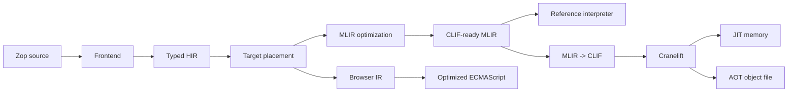

# Architecture

Zop compiles typed programs to native code. Multi-Level Intermediate
Representation (MLIR) optimizes tensor programs. Cranelift generates central
processing unit (CPU) machine code for both just-in-time (JIT) execution and
ahead-of-time (AOT) artifacts.

> **Status:** This directory defines the target architecture. The Rust
> bootstrap now reaches verified MLIR, Cranelift JIT execution, and native
> object emission for `i64` scalar host functions. It also emits deterministic
> ECMAScript modules for a restricted scalar subset. Browser objects, tensor
> lowering, the reference interpreter, ownership, effects, graphics processing
> unit (GPU) code generation, and self-hosting remain design contracts rather
> than implemented claims.

## Compilation pipeline

High-level intermediate representation (HIR) records Zop semantics after
name and type checking. Target placement preserves browser structure in browser
IR or sends tensor and native computation to MLIR. MLIR rewrites tensor
operations into explicit control flow and memory access. A planned small
interpreter will define the behavior of that restricted form. The native
backend translates the same form to Cranelift intermediate representation
(CLIF).

## Boundaries

| Area | Owns | Does not own |
| --- | --- | --- |
| [Language](language.md) | Source-level behavior and open language decisions | Compiler representation |
| [Compile-time values](compile-time.md) | Pure evaluation, `known`, and specialization | Runtime configuration |
| [Standard library](stdlib.md) | Core types, algorithms, capabilities, and official-package boundary | Application frameworks |
| [Packages and builds](package-management.md) | Package layout, imports, dependency resolution, hermetic builds, and publishing | Workspace topology |
| [Workspaces and monorepos](workspaces.md) | Members, target addresses, graph selection, and shared policy | Package semantics |
| [Artifacts and caching](artifacts.md) | Content identity, action reuse, project views, exports, and garbage collection | Compilation semantics |
| [Bessemer integration](bsmr.md) | Semantic build-graph protocol, compiler actions, cache identity, and compatibility | Build scheduling and execution |
| [Frontend](frontend.md) | Source text through typed HIR | Optimization and target layout |
| [Memory](memory.md) | Ownership, borrowing, `Mem`, and managed regions | Storage implementation |
| [Input and output](io.md) | Explicit capabilities, buffering, and cancellation | Device services |
| [Concurrency](concurrency.md) | Tasks, channels, structured lifetimes, scheduling, and parallelism | Host-specific I/O |
| [Callables](callables.md) | Members, calls, methods, closures, and dispatch | Function implementation |
| [Errors](errors.md) | Typed failure channels and mandatory handling | Recovery syntax and diagnostics presentation |
| [Intermediate representations](ir.md) | Representation layers, lowering, and verification | Machine-code emission |
| [Backend](backend.md) | CLIF translation and Cranelift code generation | Source semantics |
| [Runtime](runtime.md) | Native application binary interface, memory, and host services | Compilation policy |
| [CPU and GPU](gpu.md) | `fn` host code, `kn` kernels, placement, and launches | Vendor implementation details |
| [Web and browser](web.md) | ECMAScript, compute islands, DOM capabilities, bindings, and framework boundary | Browser implementation |
| [Web standards](../standards/web/README.md) | Pinned external requirements, suite revisions, support status, and conformance evidence | Compiler architecture |
| [Performance](performance.md) | Target floors, forbidden overhead, benchmarks, and change gates | Language semantics |
| [Automatic differentiation](autodiff.md) | Gradient semantics and compiler transformations | Tensor execution backends |
| [Testing](testing.md) | Semantic oracle, conformance, and performance gates | Language design |
| [Self-hosting](self-hosting.md) | Readiness gates, bootstrap proof, and cutover | Language or backend redesign |
| [Design lineage](design-lineage.md) | Sources, credit, and composition rationale | Compatibility promises |

Each boundary has one producer and one verifier. A stage either produces its
documented output or returns a diagnostic. It never substitutes another
compiler path.

## Initial scope

The first vertical slice targets the native CPU and statically typed `i64` host
functions. It works in both JIT and AOT modes. Fixed-rank tensors follow.
Automatic differentiation follows fixed-rank tensors. Implicit dynamic typing
is not part of the language. GPU code generation and self-hosting remain out of
scope until their semantics have explicit contracts.
