# Bessemer integration

Zop and [Bessemer](https://github.com/dedalus-labs/bsmr) (BSMR) are
co-developed so a conventional Zop package is a native BSMR package. The
integration preserves one language graph and one build-execution graph instead
of wrapping one opaque build command inside the other.

> **Status:** This page defines target semantics. BSMR does not yet recognize
> `zop.toml`, and the Zop build-graph protocol and compiler action mode
> are not implemented.

## Native experience

A normal package needs no `BUILD.bsmr`, Starlark, or duplicated source list:

```sh
bsmr init
bsmr build apps/inference
bsmr test apps/inference
```

The package path selects its default Zop target. Advanced commands use the
same stable target address in both tools:

```sh
zop build //apps/inference:app
bsmr build //apps/inference:app
```

`zop.toml`, `zop.lock`, and the pinned Zop toolchain remain
authoritative. BSMR configuration may select execution policy, but it cannot
change Zop dependency, type, target, or compiler semantics.

## Boundary

```mermaid
flowchart LR
    inputs["zop.toml, zop.lock, and source"]
    analyzer["Exact Zop analyzer"]
    protocol["Versioned semantic build graph"]
    native["BSMR native Zop adapter"]
    actions["Private BSMR action graph"]
    executor["Local or remote executor and CAS"]
    compiler["Zop compiler action mode"]
    outputs["Interface, host, device, web, test, and package artifacts"]

    inputs --> analyzer
    analyzer --> protocol
    protocol --> native
    native --> actions
    actions --> executor
    executor --> compiler
    compiler --> outputs
```



**Zop owns** manifest and lock schemas, dependency resolution, target
semantics, source closure, the compiler action interface, and diagnostics.

**BSMR owns** native package discovery, private rule lowering, action identity,
scheduling, content-addressed storage (CAS), sandboxing, materialization, and
build reports.

**Both projects own** the graph protocol, canonical paths and digests, platform
vocabulary, conformance fixtures, compatibility matrix, and release gates.

BSMR does not parse Zop source semantics or invent dependency resolution.
Zop does not own remote execution, workspace scheduling, or BSMR cache
policy.

## Semantic build graph

The read-only command

```sh
zop graph //apps/inference:app --format json-v1
```

emits canonical JavaScript Object Notation (JSON). It performs no resolution,
fetch, build, or project mutation. The document contains:

- schema and exact toolchain identities;
- workspace, package, target, and dependency identities;
- the selected source and resolved package closures;
- target kinds and public artifact kinds;
- standard-library, target-pack, and foreign-artifact identities;
- target and execution-platform constraints;
- compile, link, device, web, test, and package stages; and
- structured diagnostics for an invalid graph.

The JSON schema is the normative boundary. During the Rust bootstrap, BSMR may
call the small graph library used by this command in-process, but it must
produce the same bytes and cannot depend on private abstract syntax tree (AST),
high-level intermediate representation (HIR), or resolver types.

Paths are normalized and workspace-relative. The graph contains no absolute
host path, timestamp, ambient environment value, output directory, or local
cache location. Equal semantic inputs produce byte-identical graph output.

The graph is a semantic plan, not a BSMR action specification. BSMR decides how
to group actions, where to execute them, and how to materialize their outputs.
This lets BSMR evolve execution without changing Zop semantics.

## Compiler action mode

BSMR invokes the exact pinned compiler through a machine interface:

```sh
zop compile --request request.json
```

The request declares the input tree, compilation stage, target, relevant
`known` values, policy, output paths, and diagnostic destination. Action mode:

- never resolves dependencies or accesses the network;
- reads only declared sandbox-relative inputs;
- writes only declared outputs;
- ignores user, project, and system caches;
- emits deterministic artifacts after path normalization; and
- returns structured diagnostics with stable codes and source spans.

A future persistent compiler worker implements the same request and response
contract. Worker reuse is an optimization; disabling it cannot change outputs,
diagnostics, or legal programs.

## Action and content identity

BSMR action keys include every input that may change observable output:

- compiler, standard library, linker, target pack, and foreign tool digests;
- selected source, generated input, and dependency artifact digests;
- Zop graph and compiler-action schema versions;
- target and execution platforms;
- optimization, safety, capability, and relevant `known` values;
- declared environment, arguments, outputs, and execution policy; and
- the BSMR rule implementation that constructs the action.

The complete lockfile digest does not salt every action. Zop exposes the
selected dependency closure as canonical graph nodes, which BSMR admits to its
immutable version-set Merkle graph. An unrelated package update therefore
reruns graph analysis but does not invalidate an unaffected compilation action.

Zop and BSMR use algorithm-tagged content digests and agree on a canonical
tree encoding. A digest match is accepted only when the algorithm and encoded
object kind also match. BSMR control files are not compiler inputs; any BSMR
setting that changes execution semantics enters the action specification.

The [artifact and caching contract](artifacts.md) governs standalone builds.
Under BSMR, the compiler bypasses that standalone cache and BSMR owns action
reuse and materialization.

## Host and device builds

Host compilation, device compilation, linking, and execution are distinct
actions. A graphics processing unit (GPU) architecture belongs to the target
platform. The machine running the compiler belongs to the execution platform.
Compiling a kernel does not require a GPU worker; running its tests may.

Device actions declare the exact vendor toolkit, target image format, and legal
Multi-Level Intermediate Representation (MLIR) input. BSMR may schedule central
processing unit (CPU) and GPU work independently and reuse unchanged kernel
images across host-only changes.

## Native and custom authority

BSMR recognizes `zop.toml` as a native package manifest. It lowers the
semantic graph into private generated rules that users neither commit nor edit.

An explicit `BUILD.bsmr` is an advanced cross-language escape hatch. When
present, it is authoritative for that package and native inference is disabled.
BSMR never tries native inference after a custom-rule failure, and it never
combines two implicit target graphs.

## Maturity stages

The integration earns capabilities in order:

1. **Native local:** exact toolchain, locked inputs, target-level actions, and
   local content-addressed restoration.
2. **Remote cache:** portable toolchain, dependency, path, platform, and output
   identities; local and remote artifact digests match.
3. **Remote execution:** the executor enforces declared reads, writes,
   environment, process access, and network denial.

Until a stage passes its tests, BSMR disables the corresponding cache upload or
remote execution path. A local cached adapter is not described as hermetic
remote execution.

## Co-development contract

Zop and BSMR maintain one shared conformance corpus. Each protocol fixture
has canonical graph output, expected actions, diagnostics, artifact digests,
and invalidation expectations. Continuous integration runs the fixtures against
the Zop release candidate and the BSMR native adapter.

Protocol changes are additive within a schema version. Removing or changing a
field requires a new schema version and an explicit compatibility diagnostic.
Neither project releases first-class support for a version pair until the
shared matrix passes.

Performance gates measure cold build, no-op build, private implementation edit,
public interface edit, deleted-output restoration, unrelated-package edit,
cross-worktree reuse, and remote-cache reuse separately. Action counts and
output digests accompany timing results.

## Required tests

- Discover `zop.toml` without a handwritten build file.
- Map package paths and explicit target addresses without ambiguity.
- Reject a missing lockfile, inexact toolchain, or unsupported graph schema.
- Produce byte-identical semantic graphs from identical inputs.
- Build identical artifacts through standalone Zop and native BSMR paths.
- Prove an unrelated package edit executes no compilation action.
- Recheck without recompiling after a private implementation edit when legal.
- Restore deleted output from CAS without invoking the compiler.
- Prove one-shot and persistent-worker compiler requests are equivalent.
- Reject undeclared reads, writes, environment, processes, and network access.
- Keep native and explicit custom-rule authority mutually exclusive.
- Separate CPU, GPU compilation, and GPU execution-platform requirements.
- Preserve Zop diagnostic codes and spans in BSMR build reports.
- Exercise the shared compatibility matrix before either project releases.

## References

- [BSMR native interface](https://github.com/dedalus-labs/bsmr/blob/c89ca926c4af24b6d0e2f20ed0b907cea6be14ba/README.md)
- [BSMR ecosystem contract](https://github.com/dedalus-labs/bsmr/blob/c89ca926c4af24b6d0e2f20ed0b907cea6be14ba/docs/roadmap.md)
- [BSMR hermetic build core](https://github.com/dedalus-labs/bsmr/blob/c89ca926c4af24b6d0e2f20ed0b907cea6be14ba/docs/concepts/hermetic_build_core.md)
- [BSMR caching contract](https://github.com/dedalus-labs/bsmr/blob/c89ca926c4af24b6d0e2f20ed0b907cea6be14ba/docs/concepts/caching.md)
- [BSMR native TypeScript adapter](https://github.com/dedalus-labs/bsmr/blob/c89ca926c4af24b6d0e2f20ed0b907cea6be14ba/docs/users/languages/typescript/pnpm.md)
- [BSMR native Rust adapter](https://github.com/dedalus-labs/bsmr/blob/c89ca926c4af24b6d0e2f20ed0b907cea6be14ba/docs/users/languages/rust/cargo.md)
- [BSMR native manifest discovery](https://github.com/dedalus-labs/bsmr/blob/c89ca926c4af24b6d0e2f20ed0b907cea6be14ba/app/bsmr_common/src/package_listing/build_source.rs)
- [BSMR version-set identity](https://github.com/dedalus-labs/bsmr/blob/c89ca926c4af24b6d0e2f20ed0b907cea6be14ba/app/bsmr_common/src/version_set.rs)
- [BSMR persistent workers](https://github.com/dedalus-labs/bsmr/blob/c89ca926c4af24b6d0e2f20ed0b907cea6be14ba/docs/rule_authors/persistent_workers.md)
- [BSMR build reports](https://github.com/dedalus-labs/bsmr/blob/c89ca926c4af24b6d0e2f20ed0b907cea6be14ba/docs/users/build_observability/build_report.md)
