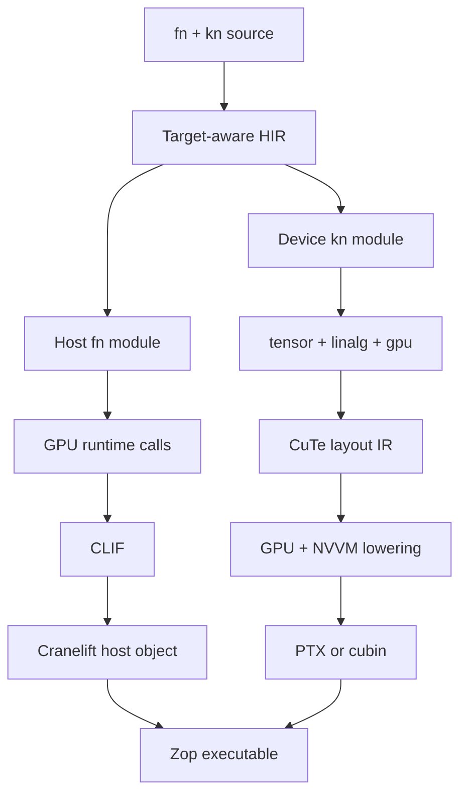

# Native CPU and GPU code

`fn` declares a central processing unit (CPU) host function. `kn` declares a
graphics processing unit (GPU) kernel. The spelling keeps target selection
visible without making GPU code feel like a foreign language.

> **Status:** This page defines an aspirational source and backend contract.
> The syntax is illustrative. NVIDIA's CuTe intermediate representation
> (CuTe IR) and the required GPU lowering stack are still young.

## Source contract

| Declaration | Target | Invocation |
| --- | --- | --- |
| `fn` | CPU host | Ordinary function call |
| `kn` | GPU device | Kernel launch from `fn` |

A host `fn` may call another `fn`. Calling a `kn` from a host `fn` launches the
kernel and produces device-resident results. The runtime does not silently move
those results back to the CPU.

Kernel tensor arguments must already reside on the device. The compiler does
not silently upload CPU tensors at a launch boundary.

Kernel borrows and asynchronous device deallocation follow the
[memory-management contract](memory.md).

A `kn` may use a pure, target-neutral `fn`. The compiler specializes that
helper for the device and rejects host effects such as files, sockets, process
state, an [`Io` capability](io.md), or host pointers. A `kn` cannot launch
another `kn` in the first GPU contract. Nested device launches require a
separate design.

A failed `kn` compilation never retries on the CPU.

Every tensor argument carries the same language-native
[Engine and Layout](layouts.md) used by CPU code and views. Engine tags the data
iterator and its address space; Layout maps logical coordinates to Engine
indices. Kernel scheduling uses additional `Layout` values for thread/value
mappings, shared-memory swizzles, and instruction fragments.

## Tensor-first example

The ideal frontend makes placement and transfers concise but visible. This is
design syntax, not an accepted grammar.

```zop
kn matmul a: f32[m, k], b: f32[k, n] -> f32[m, n]
    a @ b

fn main
    a: f32[2, 2] = [[1, 2], [3, 4]] on gpu
    b: f32[2, 2] = [[5, 6], [7, 8]] on gpu

    c = matmul a, b

    print c on cpu
```

`on gpu` requests storage from the selected device `Mem` and uploads the value.
`on cpu` downloads the value and synchronizes the dependency that produced it.
A call from `fn` to `kn` is a kernel launch even though it reads like an
ordinary call.

Tensor formatting follows the same boundary. Host `print` never downloads a
device tensor implicitly and is illegal inside `kn`; source must request the
CPU transfer shown above before formatting the result.

Launches are asynchronous. Using one kernel's result as another kernel's input
orders the launches. Explicit synchronization or a CPU transfer waits for
completion.

The frontend may let a `kn` return tensors. The GPU application binary
interface still receives output buffers explicitly. The compiler performs that
rewrite before device lowering.

The host must be able to compute each output shape before launch. A kernel with
an unknown output size fails until the language defines dynamic device `Mem`.

## Systems-level example

Tensor syntax does not hide hardware when a kernel needs direct control.

```zop
kn saxpy x: global f32[n], mut y: global f32[n], a: f32
    i = block.id.x * block.size.x + thread.id.x

    if i < n
        y[i] = a * x[i] + y[i]
```

## Systolic and matrix hardware

A systolic array is a grid of processing elements that repeatedly passes data
to neighboring elements while performing multiply-accumulate work. Tensor
processing units and many matrix accelerators use this dataflow.

Zop does not expose a separate systolic-array source type. Systolic-first means
that tensor contractions, layouts, and data movement retain their structure
until target scheduling. An eligible contraction may then lower to vector
instructions, matrix instructions, or systolic hardware selected for the
declared target. If the target cannot implement the requested `kn`, compilation
fails instead of silently moving the kernel to another device.

CPU [SIMD](simd.md) lanes are not GPU threads or systolic processing elements.
A `kn` schedule may use short vector values inside each thread, but thread/value
Layout, synchronization, and matrix-instruction legality remain GPU facts.

Memory spaces, mutability, thread identity, barriers, atomics, asynchronous
copies, and matrix instructions are typed device operations. Using one outside
a legal `kn` is a compile error.

Integer arithmetic inside `kn` follows the same trapping default as CPU code.
Overflow, invalid shifts, division by zero, and quotient rounding cannot change
merely because a kernel is optimized. Floating `/` preserves element type;
integer `//` is floor division; and concrete integer `/` is a compile error. A
device target must preserve the selected numeric contract or reject the kernel.

Explicit wrapping and saturating members are legal in `kn`. Fallible numeric
members are also legal when the kernel handles their error locally and converts
it into ordinary data, a mask, or an explicitly designed error buffer. A
failure cannot propagate through the kernel boundary, and the first GPU
contract does not permit `kn` to declare `or fails`.

Trapping tensor updates are legal. If any lane traps, the kernel aborts and the
complete device execution context becomes invalid. Safe host code can never
observe a partially updated tensor as a valid value. This follows the
[execution-domain contract](runtime.md#traps-and-execution-domains).

The default strict floating-point profile permits no silent contraction,
reassociation, type narrowing, or subnormal flushing. A kernel may select an
explicit native target profile whose complete permissions enter HIR and cache
identity. WebGPU has no materialized `f64`, so a WebGPU `kn` that requires it is
rejected rather than narrowed to `f32`. See the
[cross-target numeric contract](numerics.md).

```zop
kn fast_dot(
    left: f32[n],
    right: f32[n],
    float_profile: known FloatProfile = Strict,
) -> f32
    left @ right

result = fast_dot left, right, float_profile=Native
```

## Kernel traps and host recovery

Compilation failure, launch failure, and device execution failure are distinct:

- A compile-time unsupported operation produces a compiler diagnostic and no
  launch.
- A launch rejected before execution returns a host `DeviceError` and leaves
  existing context values valid when the target guarantees that fact.
- A trap or device fault after execution begins returns `DeviceFault` through
  synchronization or the completion handle and invalidates the whole execution
  context.

The launch owns its outputs and holds every input borrow until completion. On
success, it publishes the output tensors and releases those borrows. On
`DeviceFault`, it publishes no output and marks every allocation in the context
invalid. Existing handles can be discarded or expose saved type and layout
metadata for diagnostics. A download, later kernel, or any storage access
through one returns `DeviceLost` without touching the underlying allocation.

Recovery is explicit:

```text
kernel trap
    -> completion reports DeviceFault
    -> device context and all its values become invalid
    -> host creates a fresh context
    -> source explicitly reconstructs or uploads required values
```

Zop promises invalidation rather than rollback. Transactional device updates
would require an extra output tensor or preflight kernel on every successful
operation. Context invalidation charges recovery only to the exceptional path
and matches hardware such as CUDA, where a device assertion makes the context
and its allocations unusable.

The host may map `DeviceFault` into its own domain error and continue with CPU
control flow, logging, redundancy, or a newly created context. It cannot catch
the trap inside `kn`, inspect failed device storage, or resume the failed
context. It also cannot retry on the CPU unless source explicitly requests a
separate CPU operation; backend substitution remains forbidden.

A target with weaker native fault containment must implement this stronger Zop
boundary or reject trapping kernels. A target with stronger isolation may
invalidate a smaller physical resource internally, but every Zop value in the
language-level execution context still follows one portable invalidation rule.

## Thread and value layouts

A thread/value layout maps `(thread, value)` pairs to coordinates within a
logical tile. It is an ordinary source `Layout`, not CuTe IR syntax:

```zop
kn fragment_offset thread: int, value: int -> int
    tv = Layout(
        shape=((4, 8), (2, 2)),
        stride=((32, 1), (16, 8)),
    )

    tv(thread, value)
```

One tensor may be consumed by several thread/value layouts, so the schedule is
not stored in `tensor.layout`. Composition maps the scheduled value directly
to storage:

```text
engine index = tensor.layout(tv_layout(thread, value))
value = tensor.engine[engine index]
```

The compiler proves layout congruence, divisibility, storage bounds,
injectivity for writes, address-space legality, and required synchronization.
It rejects an invalid mapping instead of silently changing the schedule.
See the [worked data and thread/value Layout compositions](layout-examples.md#thread-and-value-mapping)
for exact offsets and resulting layouts.

Hardware instructions enter scheduling through compiler-known matrix-multiply
and copy atoms. Each atom records instruction shape, operand types, target
features, and thread/value Layouts. Atoms are target data, not new kernel
syntax. See the [layout-expression atom contract](layout-expressions.md#hardware-atoms).

Eligible zero-offset maps may lower to binary matrices over GF(2) for
equivalence and conversion analysis. Nonzero integer offsets remain outside
that representation unless the compiler proves that carries cannot occur.

A kernel parameter uses `known` only when its numerical value must change
generated device code:

```zop
kn blocked_matmul a: f32[m, k], b: f32[k, n], tile: known int
```

`tile` may determine shared-memory layout, vector width, or instruction
selection. Ordinary launch extents and symbolic tensor shapes do not require
specialization. See the [compile-time-values contract](compile-time.md).

## Frontend trace

The tensor-first example produces target-aware high-level intermediate
representation (HIR):

```text
HostFn main
  a = UploadGpu([[1, 2], [3, 4]])
  b = UploadGpu([[5, 6], [7, 8]])
  c = LaunchKernel @matmul(a, b) -> gpu f32[2, 2]
  d = DownloadCpu(c)
  Print(d)

KernelFn matmul [pure]
  result = Matmul(a, b) -> gpu f32[m, n]
  Return(result)
```

The type checker proves that the contracting extents match, the result stays on
the GPU until downloaded, and `matmul` has no host effects.

## Backend trace

The host backend produces Cranelift intermediate representation (CLIF). The
device backend lowers through NVIDIA Virtual Machine (NVVM) operations and
produces Parallel Thread Execution (PTX) assembly or a CUDA binary (cubin).



The host path lowers uploads, downloads, and launches to explicit runtime calls
before translation to Cranelift intermediate representation (CLIF). Cranelift
then emits the CPU object.

The device path lowers tensor operations into a GPU module. Language-native
`Layout` operations become CuTe IR. GPU and NVIDIA Virtual Machine (NVVM)
operations describe execution, synchronization, and target instructions. The
final device image is embedded in or shipped beside the host object.

## Upstream relationship

Zop should consume and co-develop NVIDIA's
[CuTe IR dialect](https://github.com/NVIDIA/cutlass/pull/3426) upstream. The
source `Layout` contract matches CuTe's algebra on every target, while PyCuTe
and `tensor-layouts` supply independent executable references. Zop must not
drift into a second algebra that only approximately lowers to CuTe.

The current CuTe IR contribution covers layout algebra rather than the full
copy, matrix-multiply, and tensor-compute stack. Zop GPU support therefore
remains experimental until every required operation has an upstream lowering
and a hardware-backed test.

## First proof

The first complete proof must:

- Express matrix multiplication using only Zop source.
- Compile `fn` host code with Cranelift.
- Compile `kn` device code to an NVIDIA GPU image.
- Run on real GPU hardware.
- Match the CPU reference result for every output element.
- Prove the selected hardware atom covers every required logical operand
  coordinate exactly as its pinned vendor oracle specifies.
- Show every `Mem` request, transfer, launch, and synchronization in the trace.
- Trigger one trapping kernel in an isolated context and prove every allocation
  in that context becomes inaccessible while a fresh context remains usable.
- Meet a published compile-latency budget.

## References

- [CUDA device assertions](https://docs.nvidia.com/cuda/cuda-programming-guide/05-appendices/cpp-language-extensions.html#assertion)
- [CUDA context invalidation](https://docs.nvidia.com/cuda/cuda-driver-api/group__CUDA__TYPES.html)
- [CuTe IR contribution](https://github.com/NVIDIA/cutlass/pull/3426)
- [PyCuTe](https://github.com/NVlabs/CuTe)
- [`tensor-layouts` hardware atoms](https://github.com/jduprat/tensor-layouts/tree/d9f51a435c02eb600a05f72508e681bd33dadee9/src/tensor_layouts)
- [Linear Layouts](https://arxiv.org/abs/2505.23819)
