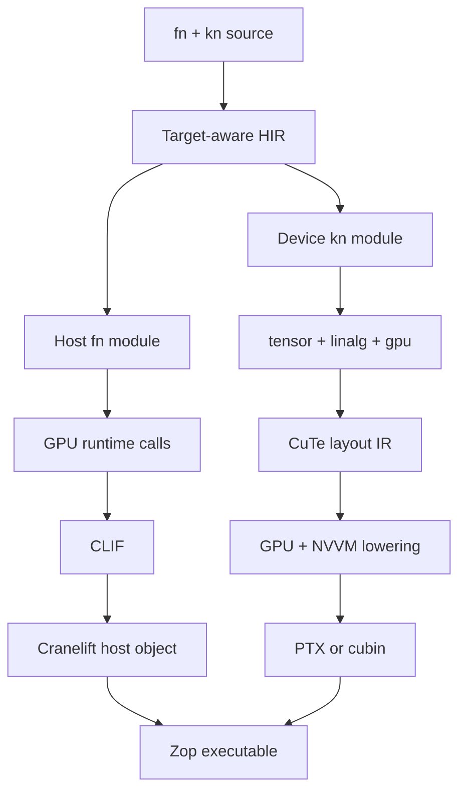

# Native CPU and GPU code

`fn` declares a central processing unit (CPU) host function. `kn` declares a
graphics processing unit (GPU) kernel. The spelling keeps target selection
visible without making GPU code feel like a foreign language.

> **Status:** This page defines an aspirational source and backend contract.
> The syntax is illustrative. NVIDIA's CuTe intermediate representation
> (CuTe IR) and the required GPU lowering stack are still young.

## Source contract

| Declaration | Target | Invocation |
| --- | --- | --- |
| `fn` | CPU host | Ordinary function call |
| `kn` | GPU device | Kernel launch from `fn` |

A host `fn` may call another `fn`. Calling a `kn` from a host `fn` launches the
kernel and produces device-resident results. The runtime does not silently move
those results back to the CPU.

Kernel tensor arguments must already reside on the device. The compiler does
not silently upload CPU tensors at a launch boundary.

Kernel borrows and asynchronous device deallocation follow the
[memory-management contract](memory.md).

A `kn` may use a pure, target-neutral `fn`. The compiler specializes that
helper for the device and rejects host effects such as files, sockets, process
state, an [`Io` capability](io.md), or host pointers. A `kn` cannot launch
another `kn` in the first GPU contract. Nested device launches require a
separate design.

A failed `kn` compilation never retries on the CPU.

## Tensor-first example

The ideal frontend makes placement and transfers concise but visible. This is
design syntax, not an accepted grammar.

```zop
kn matmul a: f32[m, k], b: f32[k, n] -> f32[m, n]
    a @ b

fn main
    a: f32[2, 2] = [[1, 2], [3, 4]] on gpu
    b: f32[2, 2] = [[5, 6], [7, 8]] on gpu

    c = matmul a, b

    print c on cpu
```

`on gpu` requests storage from the selected device `Mem` and uploads the value.
`on cpu` downloads the value and synchronizes the dependency that produced it.
A call from `fn` to `kn` is a kernel launch even though it reads like an
ordinary call.

Launches are asynchronous. Using one kernel's result as another kernel's input
orders the launches. Explicit synchronization or a CPU transfer waits for
completion.

The frontend may let a `kn` return tensors. The GPU application binary
interface still receives output buffers explicitly. The compiler performs that
rewrite before device lowering.

The host must be able to compute each output shape before launch. A kernel with
an unknown output size fails until the language defines dynamic device `Mem`.

## Systems-level example

Tensor syntax does not hide hardware when a kernel needs direct control.

```zop
kn saxpy x: global f32[n], mut y: global f32[n], a: f32
    i = block.id.x * block.size.x + thread.id.x

    if i < n
        y[i] = a * x[i] + y[i]
```

Memory spaces, mutability, thread identity, barriers, atomics, asynchronous
copies, and matrix instructions are typed device operations. Using one outside
a legal `kn` is a compile error.

A kernel parameter uses `known` only when its numerical value must change
generated device code:

```zop
kn blocked_matmul a: f32[m, k], b: f32[k, n], tile: known int
```

`tile` may determine shared-memory layout, vector width, or instruction
selection. Ordinary launch dimensions and symbolic tensor shapes do not require
specialization. See the [compile-time-values contract](compile-time.md).

## Frontend trace

The tensor-first example produces target-aware high-level intermediate
representation (HIR):

```text
HostFn main
  a = UploadGpu([[1, 2], [3, 4]])
  b = UploadGpu([[5, 6], [7, 8]])
  c = LaunchKernel @matmul(a, b) -> gpu f32[2, 2]
  d = DownloadCpu(c)
  Print(d)

KernelFn matmul [pure]
  result = Matmul(a, b) -> gpu f32[m, n]
  Return(result)
```

The type checker proves that the inner dimensions match, the result stays on
the GPU until downloaded, and `matmul` has no host effects.

## Backend trace

The host backend produces Cranelift intermediate representation (CLIF). The
device backend lowers through NVIDIA Virtual Machine (NVVM) operations and
produces Parallel Thread Execution (PTX) assembly or a CUDA binary (cubin).



The host path lowers uploads, downloads, and launches to explicit runtime calls
before translation to Cranelift intermediate representation (CLIF). Cranelift
then emits the CPU object.

The device path lowers tensor operations into a GPU module. CuTe IR describes
device layouts. GPU and NVIDIA Virtual Machine (NVVM) operations describe
execution, synchronization, and target instructions. The final device image is
embedded in or shipped beside the host object.

## Upstream relationship

Zop should consume and co-develop NVIDIA's
[CuTe IR dialect](https://github.com/NVIDIA/cutlass/pull/3426) upstream. It
should not fork the layout algebra or hide a private replacement behind the
same syntax.

The current CuTe IR contribution covers layout algebra rather than the full
copy, matrix-multiply, and tensor-compute stack. Zop GPU support therefore
remains experimental until every required operation has an upstream lowering
and a hardware-backed test.

## First proof

The first complete proof must:

- Express matrix multiplication using only Zop source.
- Compile `fn` host code with Cranelift.
- Compile `kn` device code to an NVIDIA GPU image.
- Run on real GPU hardware.
- Match the CPU reference result for every output element.
- Show every `Mem` request, transfer, launch, and synchronization in the trace.
- Meet a published compile-latency budget.
