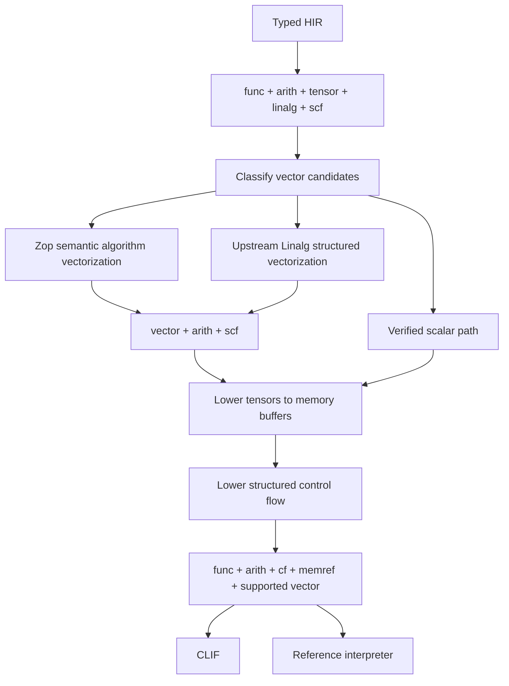

# Intermediate representations

Zop uses several intermediate representations because document object model
(DOM) handles, tensor optimization, and machine-code generation need different
information. High-level intermediate representation (HIR) preserves Zop
semantics. Browser IR preserves Web host structure. Multi-Level Intermediate
Representation (MLIR) exposes tensor operations to optimization. Cranelift
intermediate representation (CLIF) describes central processing unit (CPU)
code.

## Layers

<!-- markdownlint-disable MD013 -->

| Layer | Carries | Producer | Consumer |
| --- | --- | --- | --- |
| Typed HIR | Zop semantics | Frontend | Target placement |
| Browser IR | DOM objects, effects, modules, and updates | Target placement | ECMAScript optimizer |
| ECMAScript AST | Final JavaScript structure and source origins | ECMAScript optimizer | Printer |
| High-level MLIR | Tensor and vector operations | MLIR emitter | MLIR passes |
| CLIF-ready MLIR | Control flow, memory, and supported fixed vectors | MLIR passes | Translator |
| CLIF | CPU operations and native calls | Translator | Cranelift |

<!-- markdownlint-enable MD013 -->

## Implemented bootstrap

The current path emits an in-memory MLIR module with `func` and `arith`
operations for `i64` host functions. MLIR verifies the module. A separate
translator walks that verified module and accepts only constants, integer
arithmetic, direct calls, and returns. It produces a small scalar static
single-assignment form, where each value is defined once. The just-in-time
(JIT) and ahead-of-time (AOT) Cranelift modules share that form.

This path does not parse textual MLIR and does not bypass MLIR with a second HIR
lowering. It has no tensor passes, bufferization, control-flow lowering, or
reference interpreter yet. Its generic same-type divide and remainder nodes
represent temporary bootstrap behavior, not the target source contract.

The initial JavaScript path lowers the same typed HIR directly to an ECMAScript
abstract syntax tree. Its precedence-aware printer emits stable internal names,
compact floating-point literals, explicit exports, and no runtime helper. Typed
constant folding and effect-aware dead-expression removal run before printing.
This path proves scalar target emission; it does not yet contain browser IR,
DOM operations, source maps, target-region placement, or a general optimization
pipeline.

High-level MLIR uses standard `func`, `arith`, `math`, `tensor`, `linalg`, and
`scf` dialects. A dialect is a related family of MLIR operations. Zop adds
its own dialect only when no standard operation can preserve required language
semantics.

CLIF-ready MLIR is a pseudo-dialect: a documented set of upstream operations,
not a new namespace. Its verifier registers only the permitted dialects. Any
high-level Zop operation that crosses this boundary fails immediately.

## Tensor types

Zop tensor types map directly to ranked MLIR tensors:

```text
f32[2, 3]  -> tensor<2x3xf32>
f32[m, n]  -> tensor<?x?xf32> plus the HIR identities for m and n
```

High-level intermediate representation retains symbolic extent identities,
shape constraints, element type, rank, placement, ownership, view origins, and
the tensor's canonical [Engine and Layout](layouts.md). MLIR receives a static tensor
dimension when the Zop extent is available during compilation. The frontend
checks symbolic relationships before MLIR lowering. An extent available only at
runtime lowers to MLIR's dynamic `?` dimension.

Ranked `tensor` types describe logical values rather than committing to an
Engine or physical Layout. HIR therefore preserves both values alongside the
logical tensor. Bufferization consumes the Engine iterator and Layout mapping
when producing addresses and memory references. Fully static profiles remain
metadata; dynamic Engine state and Layout leaves become ordinary static
single-assignment (SSA) values.

HIR distinguishes affine layouts from exact composed layouts. A composed node
retains its outer map, internal offset, and inner layout. Slice HIR records any
external Engine displacement and proves residual-parent address equivalence.

Tensor literals lower to dense constants when every element is known during
compilation. Tensor operations lower to standard `tensor` and `linalg`
operations. Tuples and records normally flatten to multiple static
single-assignment values instead of becoming heterogeneous tensors.

Trailing-axis broadcasting resolves in the frontend. HIR records the source
and result shapes, the aligned axes, and every inserted zero stride before MLIR
lowering. A backend never infers a different broadcast or materializes one
silently.

Integer indexing and basic slicing also resolve to explicit residual layouts in
HIR. Positive representable slices lower to `tensor.extract_slice` and, after
bufferization, `memref.subview`. Negative-stride or hierarchical views remain
general layout mappings when one MLIR operation cannot express them. Lowering
expands the same verified coordinate map rather than inserting a contiguous
copy. See the [indexing lowering contract](indexing.md#mlir-and-backend-lowering).

Layout operations lower by target. Central processing unit (CPU) code expands
coordinate evaluation into `arith` operations before the CLIF-ready boundary.
Graphics processing unit (GPU) code lowers the same language value and algebra
to CuTe intermediate representation (CuTe IR). The reference interpreter
evaluates the canonical HIR form directly.

Pattern lowering preserves tuple and product nesting while binding each leaf to
one HIR identity. Redundant outer tuple-pattern parentheses do not survive.
Tensor indexing remains explicit and never appears as inferred destructuring.

Iterable `zip` records its source iterators and known `strict` policy. Strict
zip adds an equal-exhaustion invariant and a trap edge; non-strict zip records
shortest exhaustion. Reductions record `Source` or `Tree` order before target
placement, so a backend never invents floating-point reassociation or a
parallel schedule.

Compiler-known search, predicate aggregation, map, reduce, and scan operations
remain semantic HIR operations until the [SIMD legality pass](simd.md) consumes
their domain, Layout, alias, effect, trap, and ordering facts. The compiler does
not erase them to opaque calls or reconstruct them from scalar loops. Eligible
Linalg tensor operations take a separate upstream structured-vectorization
path after Zop selects their legal tile and vector sizes.

## Compile-time values

Pure compile-time evaluation runs before MLIR emission. A `known` parameter is
not emitted as a runtime `func` argument. Its value becomes an embedded constant
or a specialization key when it changes a concrete layout, instruction, or
control flow. Symbolic shape parameters do not force specialization. See the
[compile-time-values contract](compile-time.md).

## Polymorphic HIR and elaboration

One polymorphic HIR body carries a generic declaration after definition-time
type, constraint, ownership, effect, error, and origin checking. The compiler
simplifies this verified form before elaboration, the stage that binds the
concrete arguments required by one code-generation instance.

Elaboration evaluates pure `known` expressions through the reference
interpreter, substitutes required concrete types and layouts, and verifies the
resulting HIR. Independent instance keys may elaborate in parallel without
changing symbol identity, diagnostics, or artifact bytes. Compatible
representations may still share machine code; elaboration does not imply
universal monomorphization.

The [Mojo 1.0 compiler pipeline](https://github.com/modular/modular/blob/f66d4d522c34be0a961ffac3dbfc81e30f67942e/KGEN/docs/MojoCompilerWalkthrough.md)
validates the value of separate source-level semantic, checked parametric, and
concrete IR stages. Zop retains those stages in typed HIR rather than emitting
source-level MLIR from the parser. Target MLIR therefore receives verified
semantics instead of becoming the only representation of them.

## Numeric operations

HIR distinguishes fractional division, floor quotient, floor modulo,
truncating quotient, ceiling quotient, Euclidean quotient, and exact division.
Each operation records scalar or element type, signedness, trapping or typed
failure, and the selected floating-point profile. A generic division operation
whose meaning is chosen during backend lowering is invalid HIR.

Floating `min` and `max` remain explicit HIR operations rather than lowering to
an arbitrary comparison and select. Their NaN propagation and signed-zero
ordering must survive optimization. Tensor forms also record axis, `initial`,
and source or tree reduction order.

Integer division guards become explicit control flow before an MLIR operation
whose zero or overflow case would be undefined or poison. Strict floating-point
operations carry no unapproved fast-math flag. A non-strict profile carries its
complete permission set rather than one opaque `fast` bit. See the
[numeric contract](numerics.md#hir-and-lowering).

`require_finite` produces a flow-sensitive HIR fact attached to one tensor
identity. Immutable views preserve it. Mutation, ownership transfer, unknown
foreign effects, or storage replacement invalidate it explicitly. A lowering
that selects a finite-input vendor operation must consume a live fact or an API
operation whose visible contract performs the check.

A trap is an explicit terminating edge, not an error result. Native lowering
ends the process domain. Browser lowering ends the selected Zop application or
WebAssembly instance. Device lowering reports a failed completion and marks the
associated execution context invalid in host HIR. No optimization may move a
write or external effect across that terminating edge when doing so changes
what completes before the trap.

## Lowering



The CLIF-ready contract is deliberately narrow. The implemented slice permits
only scalar `i64` values, functions, constants, integer arithmetic, direct
calls, and returns. Its current integer divide and remainder operations are
bootstrap scaffolding. The production boundary admits each numeric operation
only after guards and quotient mode are explicit. Other scalar types, control
flow, memory operations, and fixed-width vectors enter the contract only with
tests that prove their translation. A certified vector schedule may not be
scalarized after this boundary.

Zop owns semantic opportunity recognition, legality, schedule selection, and
specialized algorithm patterns. Upstream MLIR owns reusable structured
vectorization and vector lowering. The initial pipeline does not depend on an
upstream pass discovering algorithms from arbitrary scalar control flow. See
the complete [vectorization ownership boundary](simd.md#vectorization-ownership).

MLIR turns abstract tensor values into explicit memory buffers before the
backend runs. This process is called bufferization.

MLIR's LLVM dialect is not part of this pipeline. Lowering to LLVM IR would
leave Cranelift without an input it can consume.

Browser lowering branches from typed HIR. It does not round-trip DOM handles,
events, strings, promises, or modules through numeric MLIR. A deterministic
placement pass may send a self-contained numeric region through MLIR to a
WebAssembly island while the surrounding control and DOM work remain in
browser IR. The [web](web.md) and [performance](performance.md) contracts define
that boundary.

## Tail-call lowering

After the initial backend is complete, self-recursive tail calls lower to
control-flow backedges before the CLIF-ready boundary. Other tail calls will
remain a `func.call` or `func.call_indirect` immediately followed by
`func.return`.

The verifier will reject any intervening operation or changed result. The
reference interpreter will execute the same form with a trampoline.

## Verification

The bootstrap verifies MLIR after emission. Its translator rejects every
unlisted operation before Cranelift construction. Cranelift validates the
translated function before machine-code emission. The production pipeline will
add a second MLIR verification boundary after tensor and control-flow passes.

Textual IR exists for diagnostics and golden tests. Compiler stages exchange
in-memory IR and do not depend on reparsing debug output.

## Effects

HIR and high-level MLIR preserve whether an operation reads memory, writes
memory, performs input or output, or is pure. Calls are effectful unless the
callee contract proves otherwise. Dead-code elimination and static folding
may remove only operations proven pure.

HIR also preserves ownership, borrow origins, alias guarantees, and address
spaces. Lowering may reuse or donate storage only when those facts prove that
the change is unobservable.

## Extension boundary

Typed HIR is compiler-private and versioned with the toolchain. Packages cannot
inspect or rewrite it, because that would freeze compiler internals before the
self-hosting gate.

Zop does not provide a private automatic-differentiation hook. A future public
program-transformation interface must serve multiple unrelated transformations,
consume and produce a versioned verified representation, and run as an explicit
hermetic build action. Until that contract is proven, the compiler accepts no
package-provided transformation plugin.

## Reference semantics

A planned small interpreter will execute the CLIF-ready pseudo-dialect without
Cranelift.
Differential tests run the same module through the interpreter, JIT, and AOT
paths and compare values, output, and failure classes.

The interpreter names invalid memory behavior such as null access,
out-of-bounds access, uninitialized reads, incompatible layouts, and
use-after-free. It is a semantic oracle, not a user-facing fallback.
