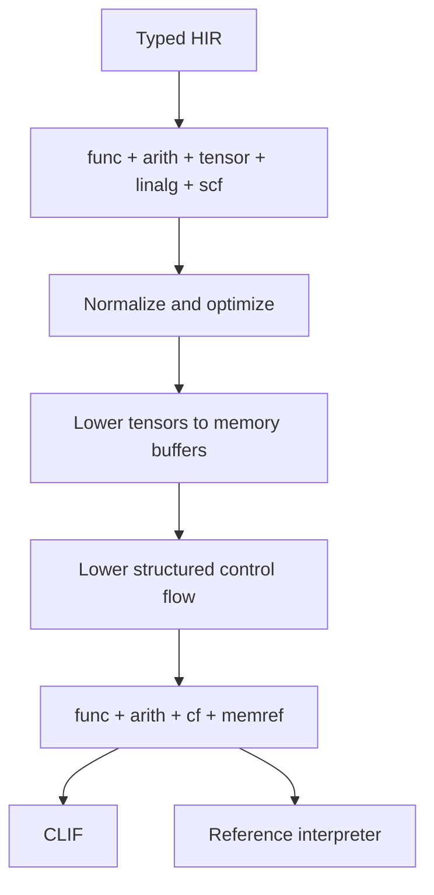

# Intermediate representations

Bedrock uses several intermediate representations because tensor optimization
and machine-code generation need different information. High-level
intermediate representation (HIR) preserves Bedrock semantics. Multi-Level
Intermediate Representation (MLIR) exposes tensor operations to optimization.
Cranelift intermediate representation (CLIF) describes central processing unit
(CPU) code.

## Layers

| Layer | Carries | Producer | Consumer |
| --- | --- | --- | --- |
| Typed HIR | Bedrock semantics | Frontend | MLIR emitter |
| High-level MLIR | Tensor operations | MLIR emitter | MLIR passes |
| CLIF-ready MLIR | Control flow and memory | MLIR passes | Translator |
| CLIF | CPU operations and native calls | Translator | Cranelift |

## Implemented bootstrap

The current path emits an in-memory MLIR module with `func` and `arith`
operations for `i64` host functions. MLIR verifies the module. A separate
translator walks that verified module and accepts only constants, integer
arithmetic, direct calls, and returns. It produces a small scalar static
single-assignment form, where each value is defined once. The just-in-time
(JIT) and ahead-of-time (AOT) Cranelift modules share that form.

This path does not parse textual MLIR and does not bypass MLIR with a second HIR
lowering. It has no tensor passes, bufferization, control-flow lowering, or
reference interpreter yet.

High-level MLIR uses standard `func`, `arith`, `math`, `tensor`, `linalg`, and
`scf` dialects. A dialect is a related family of MLIR operations. Bedrock adds
its own dialect only when no standard operation can preserve required language
semantics.

CLIF-ready MLIR is a pseudo-dialect: a documented set of upstream operations,
not a new namespace. Its verifier registers only the permitted dialects. Any
high-level Bedrock operation that crosses this boundary fails immediately.

## Tensor types

Bedrock tensor types map directly to ranked MLIR tensors:

```text
f32[2, 3]  -> tensor<2x3xf32>
f32[m, n]  -> tensor<?x?xf32> plus the HIR identities for m and n
```

High-level intermediate representation retains symbolic dimension identities,
shape constraints, element type, rank, placement, ownership, and view origins.
MLIR receives a static dimension when its value is available during
compilation. The frontend checks symbolic relationships before MLIR lowering.
A dimension whose value remains available only at runtime lowers to `?`.

Tensor literals lower to dense constants when every element is known during
compilation. Tensor operations lower to standard `tensor` and `linalg`
operations. Tuples and records normally flatten to multiple static
single-assignment values instead of becoming heterogeneous tensors.

## Compile-time values

Pure compile-time evaluation runs before MLIR emission. A `known` parameter is
not emitted as a runtime `func` argument. Its value becomes an embedded constant
or a specialization key when it changes a concrete layout, instruction, or
control flow. Symbolic shape parameters do not force specialization. See the
[compile-time-values contract](compile-time.md).

## Lowering



The CLIF-ready contract is deliberately narrow. The implemented slice permits
only scalar `i64` values, functions, constants, integer arithmetic, direct
calls, and returns. Other scalar types, control flow, and memory operations
enter the contract only with tests that prove their translation.

MLIR turns abstract tensor values into explicit memory buffers before the
backend runs. This process is called bufferization.

MLIR's LLVM dialect is not part of this pipeline. Lowering to LLVM IR would
leave Cranelift without an input it can consume.

## Future tail-call lowering

After the initial backend is complete, self-recursive tail calls will lower to
control-flow backedges before the CLIF-ready boundary. Other tail calls will
remain a `func.call` or `func.call_indirect` immediately followed by
`func.return`.

The verifier will reject any intervening operation or changed result. The
reference interpreter will execute the same form with a trampoline.

## Verification

The bootstrap verifies MLIR after emission. Its translator rejects every
unlisted operation before Cranelift construction. Cranelift validates the
translated function before machine-code emission. The production pipeline will
add a second MLIR verification boundary after tensor and control-flow passes.

Textual IR exists for diagnostics and golden tests. Compiler stages exchange
in-memory IR and do not depend on reparsing debug output.

## Effects

HIR and high-level MLIR preserve whether an operation reads memory, writes
memory, performs input or output, or is pure. Calls are effectful unless the
callee contract proves otherwise. Dead-code elimination and static folding
may remove only operations proven pure.

HIR also preserves ownership, borrow origins, alias guarantees, and address
spaces. Lowering may reuse or donate storage only when those facts prove that
the change is unobservable.

Automatic differentiation transforms typed HIR and high-level MLIR. It does
not introduce a separate framework graph or backend-specific tensor type. See
the [automatic-differentiation contract](autodiff.md).

## Reference semantics

A planned small interpreter will execute the CLIF-ready pseudo-dialect without
Cranelift.
Differential tests run the same module through the interpreter, JIT, and AOT
paths and compare values, output, and failure classes.

The interpreter names invalid memory behavior such as null access,
out-of-bounds access, uninitialized reads, incompatible layouts, and
use-after-free. It is a semantic oracle, not a user-facing fallback.
