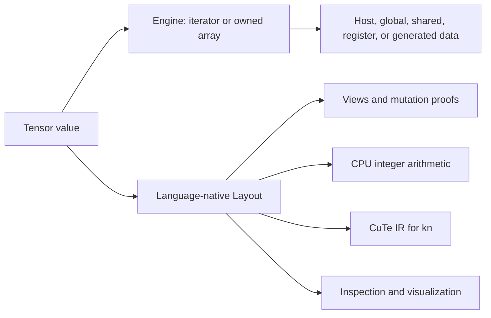

# Tensor layouts

Every Zop tensor is an `Engine` paired with a language-native `Layout`, using
NVIDIA CuTe's canonical terms. `Layout` maps a logical coordinate to an index or
another coordinate. `Engine` supplies the data iterator that the resulting
index offsets and dereferences. Zop adds ownership, bounds, placement, and
failure contracts around those two parts.

> **Status:** This page defines target language, tooling, and lowering
> contracts. The Rust bootstrap implements flat affine/composed evaluation and
> slicing, but not tensor values, hierarchy, HIR, storage, or lowering. Bracket
> syntax and view derivation follow the target
> [indexing contract](indexing.md), including endpoint clipping and explicit
> strict slicing.

The [worked examples](layout-examples.md) show verified offsets, zero-copy
views, algebra results, thread/value mappings, contraction, copy planning,
lowering traces, and dynamic descriptors beside their PyCuTe references.
The [layout-expression contract](layout-expressions.md) defines exact affine
and composed representations, nonlinear slicing, analysis, and target atoms.

## Core model

An affine layout contains a `Shape` and a congruent `Stride`. Congruent means
both have the same nested structure. Evaluating a coordinate recursively
converts it to the shape's natural coordinate, then takes its inner product
with the stride. A composed layout instead preserves an outer map, an offset,
and an inner layout when the map cannot be represented by one stride tree:

```text
AffineLayout = Shape : Stride
layout(coordinate) = index or coordinate
Compose(outer, offset, inner)(coordinate) = outer(offset + inner(coordinate))
Tensor = Engine composed with Layout
tensor[coordinate] = engine[layout(coordinate)]
```



Nested shapes preserve modes introduced by tiling, partitioning, and
vectorization. Integer strides produce integral offsets. Basis strides produce
structured coordinates and support identity tensors, predication, and by-mode
composition. A composition may add an offset, another layout, or a swizzle (a
bitwise permutation used to change memory-bank mapping). The offset remains
inside the composition when moving it through the outer map would change
addresses.
Ordinary row-major, column-major, transposed, padded, broadcast, and strided
views are instances of this one model.

Sparse, ragged, associative, and pointer-chasing structures are not ordinary
layouts because their offset depends on loaded data rather than only a
coordinate. They require an index tensor or a separate type.

## Tensor terminology

Zop core uses distinct terms for logical tensors and physical layouts:

- **Engine** is the offsettable and dereferenceable iterator or owned array that
  supplies tensor values.
- **Rank** is the number of logical coordinate directions.
- **Axis** is one zero-based logical coordinate direction.
- **Extent** is the number of positions along one axis.
- **Shape** is the ordered tuple of extents.
- **Mode** is one component of a possibly hierarchical `Layout` shape or
  stride.

Core APIs use `axis`. Axis names the direction an operation acts along;
dimension is overloaded between rank, extent, and position in common array
terminology. Zop does not provide a `dim` spelling. A PyTorch-oriented framework
may expose `dim` as a wrapper that lowers to a core axis.

Flat tensor axes and hierarchical layout modes are not interchangeable. Tiling
may split one logical axis into nested modes, while grouping may combine modes
without changing the tensor's logical rank or shape. Tensor operations such as
`unsqueeze` therefore accept an axis. Layout algebra such as `basis(mode)` acts
on a mode or mode path.

## Tensor values

Square-bracket literals create dense right-major tensors: the final source axis
has unit stride. This matches the order in which nested literals are
read and the conventional Python numerical-array layout.

```zop
test "tensor layout is inspectable"
    matrix = [[1, 2, 3], [4, 5, 6]]

    expect equal(matrix.layout.shape, (2, 3))
    expect equal(matrix.layout.stride, (3, 1))
    expect equal(matrix.layout(1, 2), 5)
    expect equal(matrix[1, 2], 6)
```

Every tensor exposes `.layout`. The property selects an ordinary first-class
value; calling that value maps a coordinate to an offset. Reading a layout is
pure and requires no `Mem` or `Io` capability.

Every tensor also exposes `.engine` as an inspectable value. Safe code may read
its element type, ownership kind, mutability, and tagged address space. Extracting
or constructing a raw iterator still follows the pointer and `unsafe` contracts.
Ordinary indexing remains `tensor[coordinate]`; users do not manually compose
the Engine and Layout for routine access.

The tensor's `.shape`, `.rank`, `extent axis=`, and `numel()` queries describe
its logical domain. Layout `.cosize` describes its physical codomain. The
[indexing contract](indexing.md#canonical-tensor-queries) defines why these
queries remain distinct and why no duplicate `length` field exists.

Tensor type equality depends on element type and logical shape, not physical
layout. Two `f32[m, n]` tensors may have different layouts. A function accepts
either unless its contract states a layout requirement.

## Engine values

Engine is the CuTe term for the data half of a tensor. It is not another name
for Shape, Stride, or Layout, and it is not necessarily a raw pointer. The
minimal capability is an iterator or owned array that can be offset and
dereferenced.

CUTLASS CuTe provides these common profiles:

- `ArrayEngine` owns a statically sized array.
- `ViewEngine` wraps a mutable random-access iterator without owning its data.
- `ConstViewEngine` wraps a read-only iterator.
- Tagged iterators state global, shared, or another supported memory space;
  owning static ArrayEngines commonly represent register storage.

PyCuTe's reference implementation uses the name Accessor for the same role.
Its `Ptr` and `Array` correspond to viewing and owning data; `ImplicitAccessor`
generates offsets without dereferencing storage; `TransformAccessor` changes a
value after reading it. These reference forms demonstrate why Engine is more
general than a base pointer.

Zop makes Engine first-class and inspectable but keeps unsafe authority narrow.
Source and tooling can inspect the Engine profile, element type, mutability,
ownership kind, and address-space tag. Safe tensor indexing composes Engine and
Layout. Directly extracting a raw iterator, advancing it without a proven
Layout operation, or constructing a ViewEngine over foreign memory requires the
pointer and `unsafe` contracts.

Engine profile is a static compiler fact. A host `ArrayEngine[i64]`, a device
`ViewEngine[gmem f32*]`, and a generated coordinate Engine are structurally
different even when their Layout is identical. The dynamic state is only the
iterator, allocation, or generator state that remains unknown at compilation.

Zop ownership augments rather than replaces Engine. An owning Engine records
the `Mem` authority responsible for release. A viewing Engine records its Zop
borrow origin and lifetime. Those facts prevent use-after-free and conflicting
mutation; they do not participate in the CuTe coordinate-to-index equation.

References: [CUTLASS CuTe Tensor Engines](https://github.com/NVIDIA/cutlass/blob/6c68991985ca8b09594ac6fd43abbfd5830c4140/media/docs/cpp/cute/03_tensor.md#tensor-engines)
and [PyCuTe Accessors](https://github.com/NVlabs/CuTe/blob/f14cb1062f8bbdeeded8f6d52b04dbdea7092a32/docs/05_tensor.md#accessors).

## Layout values

`Layout` is a compiler-known core type available without an import on every
target. Construction states shape and stride explicitly:

```zop
test "explicit layouts map coordinates"
    row_major = Layout shape=(4, 8), stride=(8, 1)
    column_major = Layout shape=(4, 8), stride=(1, 4)

    blocked = Layout(
        shape=((4, 2), (2, 4)),
        stride=((1, 32), (4, 8)),
    )

    expect equal(row_major(2, 3), 19)
    expect equal(column_major(2, 3), 14)
    expect equal(blocked.shape, ((4, 2), (2, 4)))
```

A layout exposes `.shape`, `.rank`, `.depth`, `.size`, `.compact`, and
`.injective`. An affine layout also exposes its congruent `.stride` tree. A
composed layout has no universal stride, so requesting `.stride` without an
affine proof is a compile error. `coshape` and `cosize` follow the concrete
layout-expression profile and are never substitutes for exact addressed
storage bounds. Affine forms print `Shape:Stride`; composed forms print
`outer o {offset} o inner`.
Symbolic extents such as `m`, `n`, and `k` remain attached in high-level
intermediate representation (HIR) for diagnostics and visualization even when
the canonical form uses positions.

Shape, stride, outer map, internal offset, and composition structure form a
static profile. Individual leaves may be static integers, symbolic extents, or
runtime integers. A fully static layout occupies no runtime field. Lowering
materializes only distinct dynamic leaves.

`basis(mode)` constructs a unit stride in one codomain mode. Scaling and
combining basis strides produces coordinate-valued layouts. This is Zop's
readable source spelling for CuTe's `E(mode)` notation.

The compiler tracks the nested shape/stride profile as an inferred refinement
of `Layout`; source does not spell it as a generic argument. A binding cannot
change profile after initialization. Functions remain polymorphic over layouts
whose dynamic leaves vary within one compatible profile. A structurally
different profile may require a cached specialization when it changes generated
control flow. Runtime-dynamic rank or hierarchy is outside the first tensor
contract.

## Algebra

The pure core algebra follows CuTe's definitions. Each operation is available
as a `Layout` method and through `core.layout`:

- `coalesce` removes unnecessary hierarchy while preserving integral
  coordinate evaluation.
- `compose` performs functional composition.
- `complement` describes the modes missing from a layout's codomain.
- `logical_divide` separates a tile from the grid of those tiles.
- `zipped_divide` groups every selected tile mode together and every remainder
  mode together after logical division.
- `logical_product` repeats one layout according to another.
- `right_inverse`, `left_inverse`, and `nullspace` analyze mappings.
- `recast` changes element granularity without changing addressed bytes.

Each operation states the layout-expression profiles for which its mathematics
is defined. Unsupported profile and operation pairs fail explicitly; they never
delegate to an inner affine layout and silently lose a nonlinear map.

The compiler may evaluate any operation during compilation when its arguments
are static. The same operation remains callable at runtime when dynamic leaves
make that meaningful.

```zop
test "logical divide separates tile and grid"
    linear = Layout shape=24, stride=1
    tile = Layout shape=4, stride=2
    tiled = linear.logical_divide tile

    expect equal(tiled, Layout(
        shape=(4, (2, 3)),
        stride=(2, (1, 8)),
    ))
```

Divisibility, congruence, compatibility, and inverse preconditions are checked.
A statically false precondition is a compile error. A condition depending on a
dynamic leaf returns a typed error. Failure never inserts a copy or selects a
different algebra.

## Views and mutation

A view borrows the source Engine while transforming its Layout. A slice returns
a residual layout plus an external Engine displacement and proves that their
sum matches every parent address. Affine slicing normally advances the Engine.
Slicing through a nonlinear composition may instead keep the fixed contribution
in the Layout's internal offset. Other layout transforms remain zero-copy.

The Engine displacement is not a third tensor field called an origin. Borrow
origin is separate ownership state. A composed Layout's internal offset is
coordinate algebra, not ownership metadata or an external displacement.

The [indexing and slicing contract](indexing.md) defines negative-index
normalization, slice extent formulas, negative strides, bounds failure, rank
reduction, runtime descriptors, and the exact ownership and lowering invariants
for these views.

The compiler proves that every tensor access is inside both the logical shape
and the backing storage. Calling `layout(coordinate)` is pure algebra and may
evaluate an extended coordinate. Using that result to access a tensor still
requires an in-bounds proof.

An injective layout maps every live coordinate to a distinct storage location.
Mutable views require injectivity and exclusive access. A zero-stride broadcast
or another overlapping layout may be read, but writing through it requires an
explicit reduction, accumulation, or atomic operation.

`relayout` creates a new owned tensor and therefore requires `Mem`. Zop never
inserts a hidden contiguous conversion at a call, kernel, or foreign-function
boundary.

## Broadcasting and expansion

Elementwise tensor operations use PyTorch-compatible trailing-axis
broadcasting. Starting from the final axis, two extents are compatible when
they are equal, either extent is `1`, or one operand has no corresponding axis.
Missing leading axes behave as extent `1`.

The result extent is the equal extent, or the non-`1` extent when one operand is
`1`. This means extents `0` and `1` produce `0`; extent `0` and any value greater
than `1` are incompatible. A rank-zero scalar broadcasts to every tensor shape.

```zop
activations: f32[batch, width]
bias: f32[width]

shifted = activations + bias
```

The compiler treats `bias` as shape `(1, width)` and prepends a zero stride. A
dense bias therefore produces a `(batch, width)` view with stride `(0, 1)`; a
strided bias preserves its original stride on the final axis. HIR records the
view explicitly. Source performs no allocation or copy.

Implicit broadcasting requires the type checker to prove every compatibility
rule from concrete extents and symbolic constraints. It never aligns axes from
coincidental runtime values. A relation that cannot be proven is a compile
error. Core `expand` has the same proof requirement and never adds a hidden
runtime shape check or failure channel. A future fallible dynamic-shape API must
use a different explicit member.

The allocation-free core tensor API provides:

```zop
with_batch = bias.unsqueeze axis=0
without_batch = with_batch.squeeze axis=0
expanded = bias.expand activations.shape
```

`unsqueeze` inserts extent `1` before any axis from zero through rank,
inclusive. `squeeze` requires an existing axis from zero inclusive to rank
exclusive whose extent is proven to be `1`. Core axes are nonnegative; a
framework may normalize its own negative indices before calling core.

`expand` applies the same trailing compatibility rule to an explicit target
shape. It may prepend axes or expand an extent of `1`, and represents every
expanded direction with stride zero. The target shape is exact; core uses no
`-1` sentinel. Zop exposes no separate `broadcast` keyword or redundant
`broadcast_to` core method.

An in-place elementwise operation may broadcast a read-only operand into the
existing destination shape, but it cannot change that destination shape. A
zero-stride expanded view is writable only when its live coordinate map remains
injective; otherwise mutation requires an explicit reduction, accumulation, or
atomic operation.

`repeat` and explicit materialization create owned storage. They belong in
`std.tensor` and require `Mem`. Frameworks may provide `tile`, `expand_as`,
`broadcast_to`, or `broadcast_tensors` wrappers, but they cannot redefine the
core trailing-axis rule.

## Observable representation

Layout is part of a tensor value's observable representation. Source-created
tensors have deterministic layouts, and view operations derive deterministic
layouts. The compiler may choose layouts for private temporary values, but
observing, exporting, or returning one freezes that choice.

An optimization cannot silently change the layout of an observable value.
Changing Engine and Layout together requires an explicit source operation or a
proof that neither value can be observed afterward.

## Thread and value layouts

Graphics processing unit (GPU) kernels use the same `Layout` type for
thread/value mappings. A tensor's layout maps logical coordinates to storage.
A thread/value layout maps `(thread, value)` pairs to logical tile coordinates.
They are distinct values because one tensor may be consumed by several
schedules.

```zop
kn fragment_offset thread: int, value: int -> int
    tv = Layout(
        shape=((4, 8), (2, 2)),
        stride=((32, 1), (16, 8)),
    )

    tv(thread, value)
```

Composition maps a thread and its local value directly to storage:

```text
engine index = tensor.layout(tv_layout(thread, value))
value = tensor.engine[engine index]
```

The same algebra represents shared-memory swizzles, copy partitions, matrix
instruction fragments, and register tiles. CPU code lowers layout evaluation
to integer arithmetic. A `kn` lowers the same value and operations to the CuTe
intermediate representation (CuTe IR).

## Tensor operations

Mode rearrangement can be zero-copy when it rebuilds only a layout hierarchy.
A future named-mode API may express permutation, grouping, and ungrouping, but
its source spelling remains outside the initial grammar contract.

Tensor contractions classify modes as row, column, reduction, or batch modes,
then fold operands into canonical matrix-multiplication views. `einsum` is a
tensor-library operation over `Layout`; it is not language syntax.

Copy lowering also operates on layouts. Contiguous copy, transpose, regular
gather, regular scatter, and broadcast share one logical operation whose source
and destination layouts determine address generation. Data-dependent gather or
scatter uses an index tensor. Greatest-common-domain, inverse, nullspace, and
vector-width analysis belong to compiler passes rather than ordinary copy
source.

CPU [SIMD legality](simd.md#legality-proof) uses the same map. Unit-stride
compact modes admit contiguous vectors; hierarchical composition may expose
such a mode without flattening the Layout. Regular strides may select a gather
or scatter. Negative strides, swizzles, and broadcasts retain their real lane
addresses. Vectorization never inserts a hidden contiguous copy or changes the
source Layout.

## Runtime and application binary interface

The application binary interface (ABI) preserves CuTe's two-part tensor model:

```text
Tensor<Engine, Layout>
```

[`Engine`](https://github.com/NVIDIA/cutlass/blob/6c68991985ca8b09594ac6fd43abbfd5830c4140/media/docs/cpp/cute/03_tensor.md#tensor-engines)
is CUTLASS CuTe's wrapper for an iterator or owned array. It supplies
`begin()`, an element type, a reference type, and random-access offset and
dereference behavior. Common upstream forms include `ArrayEngine`,
`ViewEngine`, and `ConstViewEngine`; tagged iterators distinguish global,
shared, and other memory spaces. PyCuTe calls the same conceptual part an
[`Accessor`](https://github.com/NVlabs/CuTe/blob/f14cb1062f8bbdeeded8f6d52b04dbdea7092a32/docs/05_tensor.md#accessors)
and provides `Ptr`, `Array`, `ImplicitAccessor`, and
`TransformAccessor`.

`Layout` owns the logical domain and coordinate-to-index map. Its affine form is
a congruent hierarchical `Shape:Stride` pair. Its composed form retains an
outer map, internal offset, and inner Layout exactly. An index has no storage
meaning until an Engine consumes it. Both parts remain necessary.

Zop retains this division rather than adding an `origin` field:

- The Engine profile states owning versus viewing behavior, element access,
  mutability, and tagged address space.
- The Engine's dynamic state contains the iterator or owned storage required by
  that profile.
- The Layout profile is the static nested structure of any affine or composed
  expression.
- Dynamic Layout leaves instantiate that profile.
- Zop ownership metadata records the `Mem` authority or borrow origin that
  keeps the Engine valid. It is checked language state, not CuTe indexing data.

Slicing demonstrates why no separate origin belongs in the ABI. CuTe returns a
residual layout and an external displacement whose composition preserves the
parent map:

```text
residual_layout, engine_delta = slice_and_offset(coordinate, tensor.layout)
result = Tensor(tensor.engine + engine_delta, residual_layout)
```

Affine slices normally advance the Engine. Nonlinear compositions may retain
the fixed contribution in the residual Layout's internal offset. A separate
origin would still duplicate Engine state.

The Engine profile, Layout profile, hierarchy, static leaves, repeated symbolic
identities, and derived algebra remain compiler metadata. Runtime ABI fields
contain only dynamic Engine state and distinct dynamic Layout leaves. Zop does
not adopt a universal rank plus two flat arrays of sizes and strides.

### Dense layout boundary

This illustrative foreign declaration requires one right-major layout:

```zop
foreign fn sum values: f32[m, n] -> f32
where values.layout matches Layout(
    shape=(m, n),
    stride=(n, 1),
)
```

Its concrete raw-pointer ABI needs a view Engine plus the dynamic Layout leaves
`m` and `n`:

```text
sum(
    engine: ViewEngine<host f32*?>,
    m: u64,
    n: u64,
) -> f32
```

The stride leaf `n` reuses the same symbolic value as the final extent. It is
not passed twice. The `ViewEngine` kind, host-memory tag, element type,
mutability, static rank, tuple profile, unit stride, and borrow duration add no
runtime field. At a C boundary the Engine lowers to its raw pointer; the other
facts remain generated binding metadata.

### General integral layout boundary

A boundary that accepts an arbitrary two-mode integral mapping states that
profile directly:

```zop
foreign fn sum_strided values: f32[m, n] -> f32
where values.layout matches Layout(
    shape=(m, n),
    stride=(row_stride, column_stride),
)
```

Slicing or another view operation advances the Engine before this call. The
remaining dynamic values are the advanced Engine iterator, two extents, and two
independent Stride leaves:

```text
sum_strided(
    engine: ViewEngine<host f32*?>,
    m: u64,
    n: u64,
    row_stride: i64,
    column_stride: i64,
) -> f32
```

This is not a special strided-tensor representation. It is one flat Layout
profile paired with a ViewEngine. A transpose, reverse, padding, and subsampling
remain ordinary values of this profile when their signed leaves satisfy the
boundary. A reverse view advances the Engine to the source's final element and
uses a negative Stride leaf; it does not pass an extra origin.

### Hierarchical layout boundary

Hierarchy is preserved rather than flattened into invented axes:

```zop
foreign fn consume_tiles values: f32[m, n]
where values.layout matches Layout(
    shape=((tiles, tile), n),
    stride=((tile * row_stride, row_stride), column_stride),
)
and m == tiles * tile
and tile is known
```

The nested row mode remains part of the static profile. If `tile` is known and
the other names are dynamic, the ABI passes `tiles`, `n`, `row_stride`, and
`column_stride` once each. Flattening `((tiles, tile), n)` to `(m, n)` would
erase the tiling fact a kernel, vectorizer, or foreign accelerator contract may
need.

Coordinate-valued basis strides, swizzles, and other structured codomains must
be composed to a bounded integral storage mapping before crossing a raw C
pointer Engine boundary. A Zop-to-Zop semantic ABI may instead carry a tagged or
custom Engine plus their versioned static Layout profile and dynamic leaves
directly. It never pretends that a structured codomain is a flat byte stride.

### Safety and conversion

Every foreign tensor contract proves Engine validity, element type, address
space, congruence, coordinate bounds, codomain bounds, alignment, placement,
and mutable injectivity. A zero-element tensor may carry a null pointer Engine;
a nonempty tensor may not. Ownership and release authority come from the
parameter mode and `Mem`, never from the iterator value.

An incompatible value is rejected. Source may construct a compatible zero-copy
view when layout algebra proves equivalence, or explicitly create an owned
`relayout` result:

```zop
dense = try to values.relayout mem, DenseRowMajor
result = sum dense
```

The compiler never inserts that allocation or copy at the boundary.

The exact `where values.layout matches` source grammar and byte-level field
packing remain open until the first foreign matrix ABI is implemented. The
Engine-plus-Layout, static-profile-plus-dynamic-leaves semantic contract is
fixed and must constrain that implementation.

## Tensor formatting

Tensor formatting is a compiler-known core contract. Emitting the formatted
bytes remains a fallible standard input/output operation and requires explicit
`Io`:

```zop
fn show io: Io -> Unit or fails with IoError
    matrix = [[1, 2, 3], [4, 5, 6]]
    try to print io, matrix
```

```text
i64[2, 3] cpu engine=ArrayEngine[host] layout=(2, 3):(3, 1)
[[1, 2, 3],
 [4, 5, 6]]
```

The header always states element type, logical Shape, placement, Engine kind and
address-space tag, and Layout. `ArrayEngine` versus `ViewEngine` makes ownership
or view status visible without a second flag. Values are traversed in logical
coordinate order, so a strided or transposed view prints what source indexing
observes rather than its Engine order.

Formatting streams directly to the supplied writer. It does not allocate or
copy another tensor. Scalar values use their canonical deterministic formatter;
floating-point values use the shortest representation that round-trips to the
same value.

Tensors with at most 1,000 logical elements print completely. Larger tensors
print the first and last three entries of each summarized axis with `...`
between them, followed by the total element count. `limit=` and `edge=` named
arguments override those values for one call. Terminal size, environment, and
mutable global configuration never change output.

Printing a device tensor never downloads it implicitly. Source first performs
an explicit CPU transfer and synchronization. Host `print` is illegal inside a
`kn` kernel.

Printing an affine `Layout` emits `Shape:Stride`. A composition prints
`outer o {offset} o inner`. Rich grids and memory-bank coloring remain explicit
`zop layout show` queries.

## Inspection and visualization

The formatter renders affine and composed canonical forms. Tooling uses the
compiler query rather than reimplementing the algebra:

```sh
zop layout show package.module.value
zop layout show package.module.kernel --tv
zop layout check package.module.value
```

`show` renders Engine profile and address-space tags, offsets, Layout hierarchy,
extent names, thread/value ownership, and memory-bank coloring as text or
Scalable Vector Graphics (SVG). A static Engine and Layout profile can be
inspected without running the program. Dynamic state and leaves remain symbolic
unless the command receives concrete values.

`check` reports form, functional equality, compactness, injectivity, addressed
bounds, gaps, divisibility, vectorization, coalescing, and possible bank
conflicts under explicit target geometry. Tooling never changes the layout.

## Lowering contract

Typed HIR stores the canonical Engine and Layout values with every tensor. The
reference interpreter evaluates their composition directly.
Central processing unit (CPU) lowering emits equivalent Cranelift integer
operations. GPU lowering maps the same types and operations to CuTe IR.

PyCuTe and `tensor-layouts` supply independent executable behavior and test
vectors. Generated fixtures are reviewed and checked in; Python is not a build
or runtime dependency.

## Required tests

- Prove right-major literal layout and coordinate evaluation.
- Compare flat, logical, and hierarchical coordinates.
- Preserve the distinction among tensor axis, extent, rank, shape, and layout
  mode in source, HIR, and diagnostics.
- Exhaust trailing-axis broadcast compatibility, including rank-zero scalars,
  missing leading axes, singleton extents, zero extents, and symbolic proofs.
- Prove `unsqueeze`, explicit-axis `squeeze`, and `expand` derive the documented
  shapes and zero strides without allocation.
- Reject implicit broadcasting that would require a runtime shape guess.
- Preserve layout and storage through every zero-copy view operation.
- Preserve every parent address when slicing affine and nonlinear composed
  layouts, including swizzles with nonzero internal offsets.
- Reject `.stride` on a composed layout without an affine proof.
- Keep `cosize` distinct from exact addressed storage bounds.
- Match the indexing corpus for integer, negative, partial, strided, reversed,
  empty, and recoverable accesses.
- Reject a tensor access outside its shape or backing storage.
- Permit extended pure layout evaluation without permitting memory access.
- Reject mutable access through a non-injective layout.
- Prove static layouts add no runtime fields.
- Materialize exactly the dynamic leaves of a partial-static layout.
- Check every algebra precondition and post-condition.
- Match PyCuTe `zipped_divide` shapes, strides, tile modes, and remainder modes.
- Compare the interpreter, Cranelift, and CuTe IR offset for every coordinate in
  the reference corpus.
- Erase every static ABI profile fact, materialize each distinct dynamic leaf
  once, and preserve hierarchical modes without flattening.
- Reject foreign layout mismatches without inserting `relayout`, then accept the
  explicit compatible view or owned conversion.
- Prove a layout failure never inserts a copy or chooses another backend.
- Render deterministic text and SVG views for storage and thread/value layouts.
- Match explicit `relayout` results across CPU and GPU targets.
- Prove every SIMD lane address from Engine and Layout, including contiguous,
  strided, reversed, broadcast, and hierarchical cases.
- Round-trip eligible bit-linear layouts through GF(2) matrices and reject
  offsets that introduce integer carries.
- Prove thread/value coverage for every registered hardware atom.

## References

- [CuTe Layout Representation and Algebra](https://arxiv.org/abs/2603.02298)
- [Categorical Foundations for CuTe Layouts](https://arxiv.org/abs/2601.05972)
- [PyCuTe reference implementation](https://github.com/NVlabs/CuTe)
- [CuTe layout and tensor algebra](https://github.com/NVlabs/CuTe/blob/f14cb1062f8bbdeeded8f6d52b04dbdea7092a32/README.md)
- [PyCuTe layout examples](https://github.com/NVlabs/CuTe/blob/f14cb1062f8bbdeeded8f6d52b04dbdea7092a32/docs/03_layout.md)
- [PyCuTe tensor examples](https://github.com/NVlabs/CuTe/blob/f14cb1062f8bbdeeded8f6d52b04dbdea7092a32/docs/05_tensor.md)
- [PyCuTe layout algebra](https://github.com/NVlabs/CuTe/blob/f14cb1062f8bbdeeded8f6d52b04dbdea7092a32/docs/04_layout_algebra.md)
- [PyCuTe visualization](https://github.com/NVlabs/CuTe/blob/f14cb1062f8bbdeeded8f6d52b04dbdea7092a32/docs/07_visualization.md)
- [`tensor-layouts` reference implementation](https://github.com/jduprat/tensor-layouts/tree/d9f51a435c02eb600a05f72508e681bd33dadee9)
- [CUTLASS CuTe layout documentation](https://github.com/NVIDIA/cutlass/blob/main/media/docs/cpp/cute/01_layout.md)
- [CUTLASS CuTe Tensor and Engine documentation](https://github.com/NVIDIA/cutlass/blob/6c68991985ca8b09594ac6fd43abbfd5830c4140/media/docs/cpp/cute/03_tensor.md)
- [CUTLASS CuTe Tensor implementation](https://github.com/NVIDIA/cutlass/blob/6c68991985ca8b09594ac6fd43abbfd5830c4140/include/cute/tensor_impl.hpp)
- [CuTe IR contribution](https://github.com/NVIDIA/cutlass/pull/3426)
- [PyTorch broadcasting semantics](https://docs.pytorch.org/docs/stable/notes/broadcasting.html)
- [PyTorch `Tensor.expand`](https://docs.pytorch.org/docs/stable/generated/torch.Tensor.expand.html)
- [PyTorch `unsqueeze`](https://docs.pytorch.org/docs/stable/generated/torch.unsqueeze.html)
- [PyTorch `squeeze`](https://docs.pytorch.org/docs/stable/generated/torch.squeeze.html)
