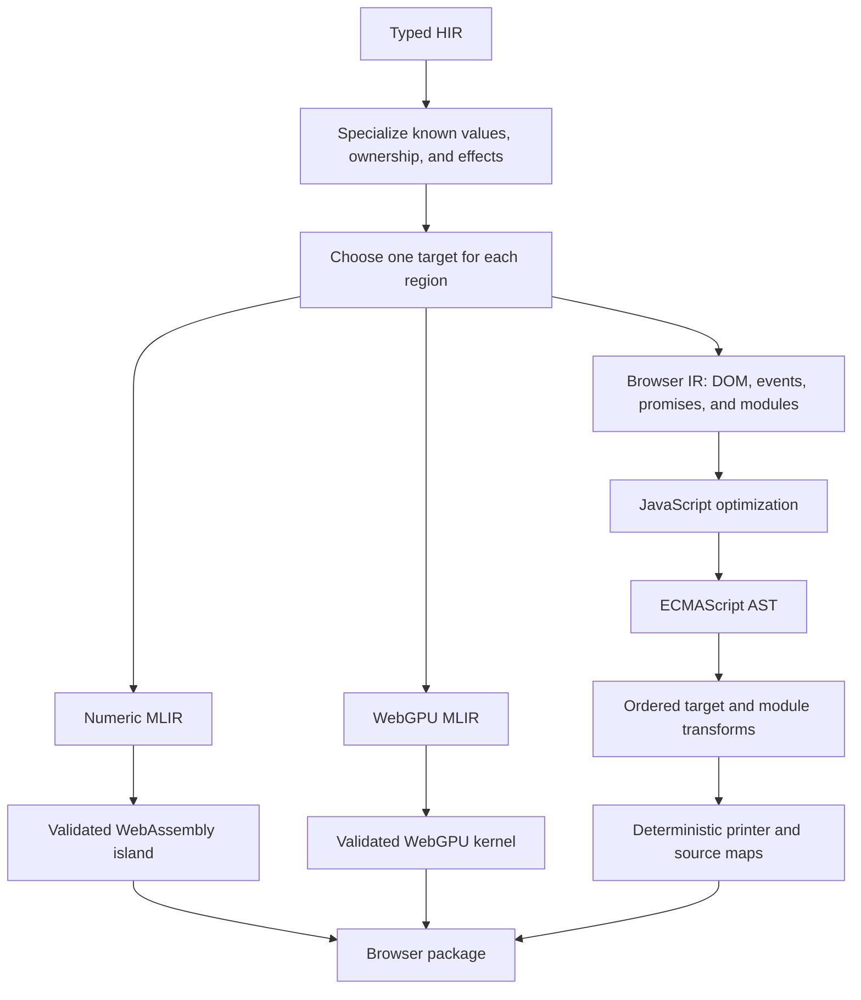

# Performance

Zop aims for zero abstraction overhead: a language feature should compile
to the same work a skilled programmer would write directly for the target.
Performance is part of correctness for systems, browser, and tensor programs.

> **Status:** This page defines target architecture and release gates. The
> bootstrap emits a restricted scalar ECMAScript module and has one reproducible
> JavaScript-expression benchmark. Browser IR, DOM lowering, source maps, target
> placement, and the full benchmark suite remain unimplemented.

## The performance frontier

No compiler can promise the globally fastest form of every program on every
machine. "Speed of light" therefore has a precise local meaning. For fixed
semantics, inputs, target, and deployment profile, generated code must perform
no avoidable work beyond the target's best direct implementation.

Zop evaluates that frontier in this order:

1. Preserve language and platform semantics.
2. Minimize observable host and device operations.
3. Minimize boundary crossings, copies, allocations, and dispatch.
4. Measure latency, throughput, memory, artifact size, and compile time.

The first three properties are inspected structurally. The last group is
measured on pinned hardware and toolchains. A faster result that changes
observable behavior fails before it enters the comparison.

Browser benchmarks use the locked [web standards
profile](../standards/web/README.md). A result from a different feature or
security profile is a different benchmark target.

Multi-Level Intermediate Representation (MLIR) is the compiler framework used
for tensor and device optimization.

<!-- markdownlint-disable MD013 -->

| Region | Primary lowering | Reference floor |
| --- | --- | --- |
| Native central processing unit (CPU) | MLIR and Cranelift | Best equivalent optimized Rust or C |
| Browser document object model (DOM) | Modern ECMAScript module | Best equivalent direct JavaScript |
| Browser numeric loop | JavaScript or WebAssembly, chosen before runtime | Faster equivalent optimized JavaScript or Rust WebAssembly |
| Browser tensor kernel | WebGPU `kn` kernel | Best equivalent WebGPU kernel |
| Native graphics processor (GPU) | Device-specific MLIR path | Best equivalent vendor kernel |

<!-- markdownlint-enable MD013 -->

"Rust-level" is meaningful for native computation, not DOM access. The browser
executes DOM operations through its JavaScript host interfaces. Zop reaches
the browser frontier by emitting those calls directly, then uses WebAssembly or
WebGPU only for regions where their execution benefit exceeds startup,
transfer, and boundary cost.

## Browser pipeline

The browser backend branches from typed high-level intermediate representation
(HIR) into browser intermediate representation (browser IR) before generic
numeric lowering destroys browser object, string, promise, event, and module
structure.

Placement is a deterministic compiler decision recorded in intermediate
representation and artifact metadata. A region selected for WebAssembly does
not retry through JavaScript when lowering fails. A region selected for WebGPU
does not retry on the CPU.

## Direct JavaScript

The ECMAScript backend adopts TypeScript's explicit transform pipeline,
copy-on-write syntax tree, deterministic names, helper dependency graph,
incremental public-signature cache, source maps, and deliberately simple
printer. TypeScript uses that architecture for erasure and compatibility.
Zop adds optimization before the printer.

Independent modules transform and print in parallel. Copy-on-write trees reuse
unchanged nodes, short-lived contexts and writers are pooled, and results return
in deterministic module order. These rules reduce compiler work; they do not
change runtime JavaScript performance.

The optimizing pipeline must:

- erase ownership, effects, shapes, and capability proofs after consuming them;
- fold constants and `known` values, remove dead code, and specialize calls;
- inline within a measured code-size budget and devirtualize proven callees;
- scalar-replace non-escaping values and minimize closure captures;
- keep object field order and numeric storage stable on hot paths;
- use typed arrays for homogeneous numeric buffers;
- compile statically known DOM construction to reusable templates and direct
  dynamic-node paths;
- preserve analyzable framework dependencies as their smallest DOM updates;
- delegate bubbling events when that uses fewer listener objects;
- coalesce repeated writes and separate layout reads from writes; and
- emit only used bindings, helpers, templates, and runtime operations.

JavaScript is primary for DOM objects, strings, events, promises, and small
control operations. WebAssembly is primary for a self-contained numeric region
only when data can remain in linear memory long enough to amortize its boundary.
WebGPU is primary only when parallel work amortizes command and transfer cost.

The compiler never moves a DOM call into a per-element JavaScript/WebAssembly
round trip. It keeps the loop in JavaScript or moves the complete numeric loop
behind one coarse call. Dynamic JavaScript interoperation blocks these proofs
at its boundary and receives an explicit optimization diagnostic.

## Work Zop avoids

<!-- markdownlint-disable MD013 -->

| Pattern | Avoided cost | Gate |
| --- | --- | --- |
| Virtual DOM by default | Component reruns, tree allocation, and diffing | Direct-update intermediate representation test |
| General client runtime | Download, parse, allocation, and dispatch | Static application emits no support runtime |
| `eval` or `new Function` | Runtime compilation and weaker Content Security Policy | Artifact scan and strict-policy browser test |
| Whole-document hydration scan | Startup work proportional to all DOM nodes | Generated paths or explicit interactive islands |
| WebAssembly for DOM glue | Host crossings and value conversion | Target-placement audit |
| One boundary call per element | Repeated marshalling and dispatch | Boundary-call counter |
| Boxed or dynamic ordinary values | Allocation and polymorphic access | Typed HIR and JavaScript-shape audit |
| Sparse or shape-changing hot objects | Dictionary storage and unstable property caches | Representation golden tests |
| Hot `BigInt` arithmetic | Allocation and slow integer operations | WebAssembly placement or explicit diagnostic |
| Legacy downlevel helpers | Larger artifacts and extra calls | Modern target profile and helper allowlist |
| Interleaved layout reads and writes | Forced layout and layout thrashing | Instrumented DOM trace |
| Hidden buffer conversion or copy | Memory traffic and garbage collection | Copy accounting in lowering reports |

<!-- markdownlint-enable MD013 -->

Frameworks may deliberately choose a virtual DOM or dynamic runtime. Those are
package costs, not language or browser-backend requirements.

## Tensor layouts

Every tensor carries a CuTe-native [Engine and Layout](layouts.md), but only
dynamic Engine state and distinct dynamic Layout leaves occupy runtime storage.
Fully static profiles add no descriptor field. Dense dynamic tensors derive
compact Strides from their Shape rather than storing redundant values.

Basic [indexing and slicing](indexing.md#performance-contract) never allocates
or moves elements. Static access may erase the entire descriptor; fixed-rank
dynamic access performs normalization, one bounds decision, and direct layout
arithmetic. A negative stride or noncontiguous view is never repaired by a
hidden contiguous copy. Tensor `numel()` is derived from shape and is not stored
as a second runtime length.

Layout algebra is also a compile-time cost. Canonicalization, composition,
tiling, inverse, and CuTe IR lowering are timed and cached by canonical layout
identity. A new layout representation must prove runtime benefit without
unbounded specialization, compile latency, or artifact growth.

Performance reports count explicit and inserted `relayout` operations. A
hidden layout conversion is a correctness failure even when the resulting
kernel is fast.

Trapping integer arithmetic is invariant across optimization profiles.
Benchmarks may use explicit wrapping or saturating operations when those are
the algorithm's semantics. They may not disable traps on ordinary operators to
manufacture a faster result.

In-place tensor arithmetic receives no hidden rollback buffer or whole-tensor
preflight pass. A trap invalidates its execution domain instead of making the
successful path transactional. Recoverable fresh-output arithmetic and an
explicit `require_finite` scan may allocate, synchronize, or traverse data only
as stated by their source contracts.

`--check-nonfinite` measures an instrumented debugging artifact, not the normal
program. Performance comparisons disable it unless the instrumentation itself
is the subject of the benchmark. Reports state its presence because device
checks and synchronization can dominate the operation being diagnosed.

Numeric type and quotient mode are equally invariant. A benchmark cannot turn
integer floor division into truncating division, cast integers to a preferred
floating type, or enable a weaker floating-point profile without changing the
benchmark contract. The selected profile appears in reports and cache identity.

The compiler eliminates floor or ceiling correction only after proving operand
signs make truncating hardware division equivalent. It combines quotient and
remainder when the target supports both. It never implements floor modulo with
overflowing intermediate arithmetic. See the [numeric contract](numerics.md).

## CPU vectorization

Zop preserves search, map, predicate aggregation, scans, reductions, tensor
operations, and Layout facts until the compiler can prove a complete
fixed-width SIMD schedule. The proof includes bounds, aliases, alignment,
effects, trap behavior, reduction order, floating-point permissions, and the
tail. It never inserts a hidden `relayout` or reads an inactive tail lane.

Every optimized artifact may emit the versioned
[vectorization report](simd.md#vectorization-report). Structural performance
tests assert the target feature set, lane shape, memory-access class, tail
strategy, bounds checks, dispatches, allocations, and reason for a scalar
schedule. A required vector path may not regress to scalar merely because
machine assembly remains functionally correct.

Zop owns semantic opportunity recognition, legality, target schedule policy,
and specialized ordered-algorithm patterns. It reuses upstream structured
vectorization for eligible Linalg operations and upstream vector lowering for
both paths. An upstream improvement may delete local compiler code after it
passes the same report and benchmark gates; waiting for that improvement is not
part of the performance plan.

Benchmarks begin below the predicted crossover, cross it, and extend through
cache-resident and memory-bound sizes. They compare an optimized scalar
reference and report throughput, latency, code size, compile time, retired
instructions, branches, and memory traffic. SIMD is a performance hypothesis
until those measurements pass; the report proves compiler structure, not
runtime speed.

## Proof suite

Every optimized path first passes the semantic interpreter and backend
conformance corpus. Performance tests then prove progressively stronger facts.

### Structural tests

- A static page emits no support runtime, WebAssembly module, or unused Web
  binding.
- One changed scalar connected to one text node performs one text write, with
  no tree walk or component rerun.
- A framework binding that defines equality suppression performs no DOM write
  when its value is unchanged.
- Two compiler-scheduled writes commit once only when intermediate state is
  proven unobservable.
- Updating one keyed row touches no sibling row.
- A DOM-only application emits no WebAssembly module.
- A numeric island crosses the JavaScript/WebAssembly boundary once per batch,
  not once per element.
- A listener is registered and released exactly once with its owner.
- Generated output contains no runtime source evaluation or legacy helper.
- Every compiler-visible copy, allocation, indirect call, host call, and target
  boundary is attributable to a source operation or documented lowering rule.
- Ordinary in-place tensor arithmetic emits no transactional copy or preflight
  scan, and nonfinite validation appears only for an explicit contract.
- Every required SIMD candidate retains its vector schedule through MLIR,
  CLIF, and pinned machine-code tests, with no hidden tail read or relayout.

### Runtime benchmarks

Each benchmark includes a behaviorally identical direct implementation. The
direct implementation is the floor; Topcoat, Leptos, Dioxus, and other
frameworks are useful competitors, not semantic or performance oracles.

The browser suite measures:

- cold download, parse, compilation, instantiation, and first interaction;
- compressed and uncompressed artifact bytes;
- DOM operations, layout passes, boundary calls, copies, and allocations;
- steady-state update latency, throughput, memory, and garbage collection;
- Interaction to Next Paint and long animation frames; and
- large keyed-list creation, replacement, partial update, selection, swap,
  append, and removal through the JavaScript framework benchmark corpus.

Chrome, Firefox, and Safari run on pinned versions and dedicated hardware.
Every comparison uses identical rendered output and interaction semantics. It
reports at least three cold and warm runs, their median, tail latency, and
variance. Benchmarks run without developer tools, thermal throttling, or other
contending work.

Native CPU tests compare wall time, retired instructions, allocations, peak
memory, code size, and assembly with optimized Rust and C. Browser compute
tests compare JavaScript and WebAssembly on the same algorithm and data layout.
GPU tests include transfer and launch time instead of timing only the kernel.

## Change gate

A performance-sensitive change may land only when:

- its semantic and operation-count tests pass;
- the benchmark names its floor, competitor, hardware, browser, and target;
- its failure threshold is fixed before the run and exceeds measured noise;
- one isolated change produces the claimed improvement;
- no protected workload regresses beyond its published budget;
- artifact size, memory, startup, steady state, and compile time are reported
  separately; and
- an optimization pass pays for its compilation cost on the representative
  corpus.

When results flatten, Zop keeps the simpler lowering. No adaptive policy is
added without a workload that proves the need.

The first [JavaScript core baseline](../../benchmarks/javascript/baseline-2026-08-17.md)
found Zop, direct JavaScript, and Topcoat at parity for warmed `f64` affine
arithmetic. JavaScriptCore removed Topcoat's temporary wrapper cost. That result
rules out wrapper arithmetic as a useful optimization target and directs the
next benchmarks toward retained reactive, DOM, and host-boundary work.

## References

- [Rust zero-cost abstractions](https://doc.rust-lang.org/stable/book/ch00-00-introduction.html)
- [TypeScript compiler emitter](https://github.com/microsoft/TypeScript/wiki/Codebase-Compiler-Emitter)
- [TypeScript Go emitter](https://github.com/microsoft/typescript-go/blob/e8359e74015bbcc68cfa2a4d24430dd99b941259/internal/compiler/emitter.go)
- [Topcoat Rust-to-JavaScript expressions](https://github.com/tokio-rs/topcoat/blob/a2bd596af2a149f38fcf49570481f356a6cb1069/crates/topcoat-runtime/grammar/src/expr.rs)
- [Leptos architecture](https://github.com/leptos-rs/leptos/blob/0625dfd15230b05174284fd56642681b918460fb/ARCHITECTURE.md)
- [Dioxus Web mutation writer](https://github.com/DioxusLabs/dioxus/blob/393d190a801ccb441d41923e232289b4f8a5c669/packages/web/src/mutations.rs)
- [JavaScript framework benchmark](https://github.com/krausest/js-framework-benchmark)
- [V8 fast properties](https://v8.dev/blog/fast-properties)
- [Avoiding layout thrashing](https://web.dev/articles/avoid-large-complex-layouts-and-layout-thrashing)
- [Long Animation Frames API](https://developer.chrome.com/docs/web-platform/long-animation-frames)
- [WebAssembly 3.0 introduction](https://webassembly.github.io/spec/core/intro/introduction.html)
- [Everyone Should Know SIMD](https://mitchellh.com/writing/everyone-should-know-simd)
- [MLIR Vector dialect](https://mlir.llvm.org/docs/Dialects/Vector/)
- [Cranelift intermediate representation](https://github.com/bytecodealliance/wasmtime/blob/main/cranelift/docs/ir.md)
