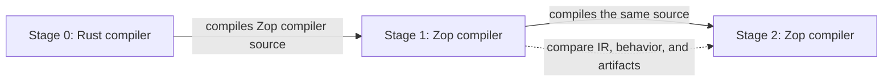

# Self-hosting

Self-hosting begins when Zop is stable enough to implement its compiler
without redesigning the language or compiler architecture. It is evidence of
maturity, not a way to discover missing semantics.

The gate treats typed high-level intermediate representation (HIR) and the
runtime application binary interface (ABI) as versioned contracts.
It requires both just-in-time (JIT) and ahead-of-time (AOT) compilation.
The [roadmap](roadmap.md) schedules the gate at 0.7, the bootstrap proof at
0.8, and compatibility freeze at 0.9.

## Entry gate

Every gate must pass before work starts on a compiler written in Zop.

**Language.** The core specification has no open decisions about syntax,
types, compile-time evaluation, memory, errors, modules, packages, standard
library boundaries, functions, or concurrency.

**Stability.** Source semantics, typed HIR, the runtime ABI, and backend
contracts survive three consecutive releases without a breaking redesign.

**Correctness.** Parser, type checker, lowering, interpreter, JIT, and AOT tests
cover the supported language. Fuzzing cannot crash the compiler on user input.

**Dogfooding.** Zop ships a formatter, a build or package tool, a
substantial systems program, and a tensor library or framework. All four
remain in use across two releases. The compiler workspace also builds through
the [native Bessemer integration](bsmr.md) from the same manifests and lockfile.

**Toolchain.** The [standard library](stdlib.md),
[package manager](package-management.md), [workspace system](workspaces.md),
native [Bessemer integration](bsmr.md), modules, diagnostics, foreign calls,
the [artifact store and cache](artifacts.md), and deterministic builds are
production-ready.

**Operations.** Stage 0 builds from pinned sources on every supported host. It
remains auditable without network access.

**Performance.** Compiling the compiler fits published time and memory budgets
on a supported development machine.

Passing most gates does not open the milestone. Any failed gate keeps
self-hosting closed.

## Bootstrap proof

The mature Rust compiler becomes the permanent stage-0 bootstrap root.

Stage 0 stays intentionally small. It uses pinned community crates for token
recognition, MLIR construction, and native code generation where they remove
substantial code. Zop-specific semantics remain in concrete modules, typed IR,
verifiers, and conformance tests so they can be ported without translating a
Rust framework architecture.

Stage 1 must compile the complete compiler and standard library. Stage 2 must
then compile the same sources without help from stage 0.

Multi-Level Intermediate Representation (MLIR) and Cranelift intermediate
representation (CLIF) dumps make the compiler's decisions comparable.
JIT and AOT tests prove both execution modes.

The two stages must:

- Accept and reject the same conformance corpus.
- Produce identical normalized HIR, MLIR, and CLIF for that corpus.
- Match the reference interpreter in JIT and AOT modes.
- Pass the same diagnostic, runtime, and ABI tests.
- Produce reproducible compiler artifacts after normalizing paths and
  timestamps.

Any unexplained difference is a failed bootstrap.

## Cutover

Self-hosted components develop as ordinary Zop libraries while stage 0
remains the release compiler. Each component must pass the existing contract
tests before integration. The default compiler changes only after the full
bootstrap proof passes on every supported host.

Stage 0 remains supported after cutover. It is the recovery path when a new
compiler cannot build itself and the audit path for reproducing the toolchain
from non-Zop sources.

MLIR and Cranelift remain external compiler libraries. Self-hosting requires
Zop to implement its own frontend, semantic analysis, lowering, and driver.
It does not require reimplementing either code-generation project.
