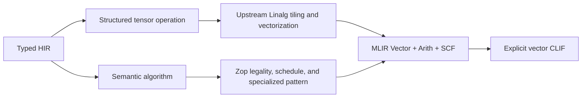

# SIMD and vectorization

Single instruction, multiple data (SIMD) executes one operation over several
scalar lanes in one vector instruction. Zop treats SIMD as a central
processing unit (CPU) execution schedule for ordinary typed operations, not as
a second source language.

> **Status:** This page defines target semantics and compiler gates. The Rust
> bootstrap emits scalar Cranelift intermediate representation (CLIF) only.
> Automatic vectorization, `core.simd`, vectorization reports, and their
> conformance tests are not implemented.

## Principle

Source states the operation and its observable order. The compiler proves a
vector schedule from types, effects, ownership, bounds, and the tensor's
[Engine and Layout](layouts.md). A target profile then selects one legal
schedule before code generation.

Multi-Level Intermediate Representation (MLIR) carries target-neutral vector
work. CLIF carries the fixed-width CPU operations used for native code
generation.

```text
typed operation
      ↓
vectorization legality and cost
      ↓
MLIR vector operations
      ↓
fixed-width CLIF vector operations
      ↓
x86 or Arm machine instructions
```

SIMD is not concurrency. It creates no task, thread, cancellation point, data
race, or scheduling effect. Parallel loops and tasks may contain vectorized
work, but their lifetime and synchronization rules remain independent.

Zop does not promise that every loop vectorizes. It does promise that a
compiler-known operation has one explicit vectorization decision, that a
rejected vector schedule has a machine-readable reason, and that a required
vector schedule cannot silently become scalar after an unrelated change.

## Source operations

Ordinary tensor arithmetic, comparisons, copies, and explicit `Tree`
reductions are compiler-known. The initial allocation-free search and
aggregation family in `core.algorithm` is:

<!-- markdownlint-disable MD013 -->

| Operation | Result | Observable order |
| --- | --- | --- |
| `find_first` | `Option[int]`: first matching index or no value | Increasing logical index |
| `any` | Whether any predicate result is true | Result only |
| `all` | Whether every predicate result is true | Result only |
| `count` | Number of matching values | Result only |
| `map` | One result per input value | Logical output coordinates |
| `reduce` | One aggregate | Explicit `Source` or `Tree` order |
| `scan` | One prefix result per input value | Explicit `Source` or `Tree` order |

<!-- markdownlint-enable MD013 -->

`count` scans values selected by a predicate. Tensor `.numel()` only derives
the logical domain size from Shape, so the two operations are unrelated.
Data-dependent filtering is not a core SIMD primitive because its output size
and storage are not allocation-free; it belongs in `std.tensor`.

The first `find_first` contract is deliberately one-dimensional. It returns an
index relative to the receiver view. A caller adds a slice offset when it needs
an index in the source tensor:

```zop
import core.algorithm as algorithm

fn is_control codepoint: u32 -> bool
    codepoint <= 0xF

fn first_control_offset codepoints: u32[n], start: int -> Option[int]
    algorithm.find_first codepoints[start:], is_control
```

The result above is relative to `codepoints[start:]`; a caller adds `start`
after handling the optional value. For a view with a nontrivial Layout,
increasing logical index means the receiver's coordinate order, not increasing
Engine address. Higher-rank search requires an explicit one-dimensional view
until a coordinate-result API is justified.

An arbitrary scalar loop remains legal and may be recognized by a later loop
vectorizer. Code that requires stable vector code generation uses the semantic
operation or the provisional expert API rather than depending on heuristic
loop recognition.

## The common schedule

The common fixed-width schedule has five parts:

1. Broadcast constants and initialize vector accumulators.
2. Traverse one vector-width chunk at a time.
3. Compare, transform, or combine all lanes.
4. Store or reduce the vector result.
5. Execute a masked or scalar tail for the remaining values.

The tail is part of the selected schedule, not a retry after vector code
generation fails. A target may prefer one masked final iteration when masked
memory operations are efficient. Another target may prefer full vector chunks
plus a scalar epilogue. Both schedules must be selected and verified before
backend emission.

`find_first` preserves first-match semantics by visiting chunks in increasing
logical order and selecting the lowest matching lane in the first matching
chunk. It may compare all lanes in a chunk because the predicate is proven
pure and those comparisons have no observable order.

## Legality proof

A vector schedule is legal only when every item below is proven.

### Domain and bounds

- Shape determines the exact logical iteration domain.
- Layout maps every active logical lane to an in-bounds Engine index.
- A full-chunk loop cannot read beyond the domain.
- A masked tail suppresses every inactive memory access.
- A scalar tail begins at the first value not handled by a full chunk.

An unchecked wide load followed by discarding excess lanes is illegal. The
fact that a page is mapped or an allocator rounded the buffer size does not
make out-of-domain values readable.

### Layout and memory

Unit-stride compact modes admit contiguous loads and stores. Coalescing and
composition may prove that a hierarchical Layout contains such a mode without
flattening the source representation. Regular non-unit strides may admit a
gather or scatter when the target supports it and the cost model selects it.
Negative strides, broadcasts, swizzles, and general compositions retain their
actual address maps.

The compiler never materializes a contiguous temporary merely to make
vectorization succeed. A required `relayout` remains explicit in source. A
zero-stride broadcast may reuse one loaded value across lanes, but a write
through a non-injective Layout remains illegal.

Alignment is a proved property of the Engine, base offset, element size, and
Layout. The backend uses aligned memory flags only with that proof. Otherwise
it emits a legal unaligned operation or selects a different schedule.

### Ownership, aliases, and effects

Read-only views may overlap. Writable lanes must be pairwise independent, and
no live alias may observe an intermediate store unless source semantics allow
it. A call inside the candidate region blocks vectorization unless its body or
checked contract proves the required purity, target legality, and lane
independence.

Input/output, volatile access, atomics, unknown foreign calls, task operations,
and traps preserve their stated ordering. The compiler may vectorize around
them only when the same completed effects and terminating edge remain
observable.

### Numeric semantics

Ordinary fixed-width integer operators still trap on overflow. A vector
schedule must detect every overflowing active lane before publishing a result
whose scalar execution would not complete. Explicit wrapping and saturating
operations use their named lane semantics. Fallible operations preserve their
complete error result rather than becoming traps.

Strict floating-point operations do not reassociate, contract, approximate, or
flush subnormal values merely to use a vector instruction. `Source` reductions
preserve logical reduction order. `Tree` reductions permit the documented
regrouping and are therefore the normal vector and parallel reduction form.
The complete floating-point profile remains part of the schedule and cache
identity.

### Profitability and target support

Legality does not imply speed. The compiler estimates trip count, alignment,
address-generation cost, gathers, tails, register pressure, code size, and
target instruction support. Small or irregular domains may deliberately select
a scalar schedule. That decision is reported as `scalar_by_cost`, not hidden
as a missed optimization.

## Layout-driven example

These views contain the same logical values but expose different schedules:

```zop
matrix = [[0, 1, 2, 3], [4, 5, 6, 7]]
row = matrix[0, :]
column = matrix[:, 0]
reversed = matrix[0, ::-1]

# (4):1: one contiguous vector load may cover the row.
print io, row.layout

# (2):4: a gather or scalar schedule follows the real stride.
print io, column.layout

# (4):-1 with an advanced Engine: lane order is logically reversed.
print io, reversed.layout
```

A `known` Layout can erase all descriptor work while still driving schedule
selection. Dynamic Shape or Stride leaves remain ordinary static
single-assignment (SSA) inputs; they do not make the element type dynamic.

## HIR contract

Typed high-level intermediate representation (HIR) preserves semantic
operations before they become loops:

```text
FindFirst {
  input,
  predicate,
  logical_domain,
  engine,
  layout,
  result = Option<int>,
  effects = Pure,
}
```

Elementwise operations retain Shape, Layout, placement, alias identities,
trap behavior, and floating-point permissions. Reductions and scans retain
their identity, combining operation, axes, and `Source` or `Tree` order.

The vectorization pass consumes those facts and records a schedule containing:

- scalar and vector element types;
- lane count and target feature set;
- logical tile and Engine address map;
- alignment and alias proofs;
- bounds strategy;
- reduction tree, when any;
- tail strategy; and
- the reason a candidate was accepted or rejected.

Lowering does not reconstruct this information from a scalar loop after HIR
has erased it.

## Vectorization ownership

Zop does not wait for an MLIR pass that discovers vector schedules in every
scalar program. It owns the compiler work that depends on Zop semantics:

- retaining semantic algorithms in HIR;
- proving legality from Shape, Layout, ownership, aliases, effects, traps, and
  numeric profiles;
- selecting target lane counts, tails, masks, and memory access;
- lowering ordered algorithms such as `find_first` into explicit vector work;
- reporting every accepted or rejected schedule; and
- enforcing semantic, structural, assembly, and performance gates.

Upstream MLIR supplies reusable compiler machinery. Zop reuses:

- Linalg, MLIR's structured tensor-operation dialect, for tiling, fusion, and
  structured vectorization;
- Transform dialect orchestration when it simplifies a proven pipeline;
- Vector types, masks, transfers, reductions, scans, contractions, and target
  lowering;
- affine-loop analysis where its preconditions hold; and
- bufferization, memory planning, and deallocation.

MLIR's structured control flow (SCF) represents loops and branches. The two
vectorization paths converge before Cranelift:



The initial compiler does not attempt to discover arbitrary algorithms from
scalar `scf` loops or straight-line operations. That remains opportunistic
future optimization, never the implementation of a required semantic schedule.
If upstream later provides an equivalent transformation, Zop may delete its
local pattern only after the same verifier, report, and performance gates pass.

## MLIR lowering

High-level tensor work first uses `tensor`, `linalg`, and structured control
flow. Upstream structured vectorization handles eligible Linalg operations
after Zop selects legal tile and vector sizes. It does not discover ordered
searches from scalar loops. Zop-specific transformations lower semantic search
and parsing operations directly into `vector`, `arith`, and `scf` operations.
Both paths run before bufferization erases useful structure.

MLIR supplies multidimensional vector values, transfer operations, masks,
gathers, scatters, reductions, scans, contractions, and progressive target
lowering. It does not supply Zop's source-level legality, schedule selection,
or performance promise.

A fixed eight-lane `find_first` chunk is represented schematically as:

```mlir
%values = vector.transfer_read %buffer[%i], %padding
    : memref<?xi32>, vector<8xi32>
%limit = vector.broadcast %c15 : i32 to vector<8xi32>
%matches = arith.cmpi ule, %values, %limit
    : vector<8xi32>
%lanes = vector.step : vector<8xi32>
%sentinel = vector.broadcast %c8 : i32 to vector<8xi32>
%candidates = arith.select %matches, %lanes, %sentinel
    : vector<8xi1>, vector<8xi32>
%first = vector.reduction <minui>, %candidates
    : vector<8xi32> into i32
%found = arith.cmpi ult, %first, %c8 : i32
```

This form keeps first-lane meaning in upstream operations. A masked tail adds
`vector.create_mask` and predicates its transfer. A scalar-tail schedule exits
the vector loop before the incomplete chunk.

MLIR's Transform dialect is a candidate representation for compiler-owned
tiling, vectorization, and unrolling schedules because it separates transform
IR from the program IR it transforms. The first implementation may call the
same rewrite utilities directly when that is smaller. Transform IR is not a
source language, a stable package extension interface, or a dependency for
Zop's initial performance contract.

## Cranelift lowering

The CLIF-ready boundary initially admits fixed-width vectors whose lanes and
operations are supported by the selected Cranelift target. Cranelift vector
types have a scalar lane type and a power-of-two lane count. The translator
must reject an unsupported vector operation or type before machine emission;
it cannot scalarize after a required vector schedule was certified.

The `find_first` comparison maps naturally to CLIF:

```clif
v_threshold = splat.i32x8 v_limit
v_matches = icmp ule v_values, v_threshold
has_match = vany_true v_matches
mask = vhigh_bits v_matches
lane = ctz mask
```

CLIF comparisons produce all-one matching lanes. `vhigh_bits` collects the
most-significant bit of each lane into a scalar integer. Scalar count trailing
zeros (`ctz`) finds its first set bit after `has_match` is true. The translator
normalizes and tests the lane-to-bit order rather than assuming a host
endianness. `any` and `all` map to `vany_true` and `vall_true`; other reductions
use only target-supported CLIF operations or fail the vector schedule gate.

The first implementation supports one pinned current-host fixed-width profile;
the first production matrix covers x86-64 and AArch64. Scalable vectors require
a separate source, application binary interface (ABI), testing, and cost
contract before Arm Scalable Vector Extension (SVE) or RISC-V Vector Extension
support can be claimed.

## Target variants

One target-specific artifact contains only instructions allowed by its declared
profile. A portable native artifact may contain several fully compiled and
verified function variants plus one feature dispatch at the public entry. The
dispatch selects by reported CPU capabilities; it never catches a compilation
or execution failure and retries another implementation.

Every variant has an independent cache entry. Its action key contains target
triple, CPU features, floating-point profile, relevant `known` values,
vectorization policy, and required-vector assertions. The selected lane shape
and schedule enter the output report and artifact content digest. Just-in-time
(JIT) compilation chooses the host profile before lowering. Ahead-of-time
(AOT) compilation uses the manifest's explicit baseline or variant set.

## Browser boundary

Direct ECMAScript retains the semantic operation but cannot certify which SIMD
instruction a JavaScript engine will generate. A self-contained numeric
WebAssembly island may use the WebAssembly fixed-width vector profile when its
placement already amortizes the host boundary. The compiler never creates
per-element JavaScript/WebAssembly calls to obtain SIMD.

WebGPU and GPU `kn` execution remain data-parallel target schedules governed by
the [GPU](gpu.md) and [web](web.md) contracts. They may reuse MLIR vector
operations internally, but CPU vector lanes, GPU threads, and matrix
instructions are not interchangeable source concepts.

## Expert vectors

A provisional `core.simd` module will expose portable fixed-width vector and
mask values for algorithms the compiler cannot yet recognize. Its minimum
surface is vector construction, broadcast, aligned or unaligned load and
store, comparison, selection, lane extraction, shuffles, masks, and explicit
reductions.

```zop
import core.simd as simd

lanes: known int = 8
type Values = simd.Vector[u32, lanes]
type Matches = simd.Mask[lanes]
```

The exact callable spellings remain provisional until the same corpus works on
x86-64 and AArch64. Lane count is a compile-time value for this initial API.
Vector and mask types are target-constrained implementation values and do not
enter Zop's stable foreign ABI. Public boundaries use scalars, tensors, or
explicit byte layouts.

`core.simd` contains no vendor mnemonic zoo. Target-specific intrinsics, when
unavoidable, belong behind an explicit target module and cannot masquerade as
portable operations. Ordinary users should prefer semantic algorithms and
tensor operations.

## Vectorization report

Every optimized build can emit a versioned machine-readable vectorization
report. Each candidate records:

- source span and stable HIR operation identity;
- accepted vector schedule or scalar reason code;
- target features, lane type, lane count, and alignment;
- contiguous, gather, scatter, or broadcast memory access;
- full-chunk and tail strategy;
- inserted bounds checks, copies, allocations, and target dispatches;
- preserved effect, trap, reduction-order, and floating-point contracts; and
- pass time plus the target cost estimates used for the decision.

The report is evidence, not a proof that runtime latency improved. Performance
still requires measurement. Stable reason codes let tests reject a lost vector
schedule without matching prose or assembly formatting.

The first stable reason set is:

<!-- markdownlint-disable MD013 -->

| Code | Meaning |
| --- | --- |
| `vectorized` | One complete vector schedule was selected |
| `scalar_by_cost` | Vectorization was legal but lost the target cost decision |
| `blocked_by_layout` | No legal target access represented the Engine and Layout |
| `blocked_by_alias` | Writable lane independence or external observation was unproven |
| `blocked_by_effect` | An ordered or unknown effect prevented lane execution |
| `blocked_by_order` | Source reduction or scan order prohibited regrouping |
| `blocked_by_trap` | The schedule could not preserve the terminating edge |
| `unsupported_operation` | The selected backend lacked a required vector operation |
| `unsupported_target` | The target profile declared no conforming vector schedule |

<!-- markdownlint-enable MD013 -->

A code-generation test identifies a stable HIR operation and target profile,
then constrains report fields such as decision, minimum lane count, tail form,
and maximum hidden copies or allocations. Failure is a test failure before
runtime benchmarks execute. The exact command and source spelling remain open
until the test-manifest protocol is implemented; the versioned report and
assertion data are the stable compiler boundary.

## Required tests

Semantic tests compare the scalar reference schedule, MLIR interpreter, JIT,
and AOT result for:

- empty inputs and lengths around every supported vector width;
- every possible first matching lane, no match, and tail-only matches;
- aligned and deliberately unaligned starts;
- contiguous, strided, reversed, broadcast, and hierarchical Layouts;
- overlapping read-only views and rejected writable aliases;
- integer overflow, fallible arithmetic, and inactive masked lanes;
- strict floating-point and explicit `Source` and `Tree` reductions; and
- target variants with and without each advertised vector feature.

Structural tests prove:

- eligible shaped tensor work reaches MLIR Vector through upstream structured
  vectorization;
- ordered semantic algorithms reach MLIR Vector through Zop-owned patterns;
- accepted schedules contain the expected MLIR `vector` operations;
- the CLIF-ready verifier rejects every unsupported vector type or operation;
- no required semantic schedule reaches Cranelift as a scalar loop;
- first-match lowering uses a lane mask and scalar first-set-bit operation;
- a required vector schedule cannot become scalar;
- a scalar-by-cost decision carries its reason code;
- no hidden `relayout`, temporary allocation, out-of-domain load, or target
  retry appears; and
- action identity changes with target and policy inputs, while output content
  identity changes with the selected schedule.

Pinned machine-code tests inspect representative x86-64 and AArch64 artifacts.
Benchmarks compare the semantic operation with an optimized scalar reference
at small, crossover, and large sizes. They report throughput, tail latency,
code size, compilation time, retired instructions, branches, and memory
traffic. A vector optimization lands only when correctness and structural gates
pass before the benchmark is considered.

## References

- [Everyone Should Know SIMD](https://mitchellh.com/writing/everyone-should-know-simd)
- [MLIR Vector dialect](https://mlir.llvm.org/docs/Dialects/Vector/)
- [MLIR structured vectorization](https://mlir.llvm.org/python-bindings/autoapi/mlir/dialects/transform/structured/index.html)
- [MLIR affine super-vectorization](https://mlir.llvm.org/doxygen/SuperVectorize_8cpp.html)
- [MLIR Transform dialect tutorial](https://mlir.llvm.org/docs/Tutorials/transform/)
- [IREE generic vectorization](https://iree.dev/reference/mlir-passes/CodegenCommon/)
- [Cranelift intermediate representation](https://github.com/bytecodealliance/wasmtime/blob/main/cranelift/docs/ir.md)
- [Cranelift vector type source](https://docs.wasmtime.dev/api/src/cranelift_codegen/ir/types.rs.html)
