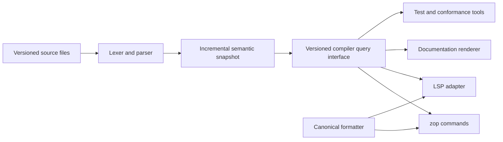

# Developer tooling and language server

Zop has one compiler-backed understanding of source shared by the command-line
interface, formatter, documentation generator, and editor integrations. The
Language Server Protocol (LSP) process is an adapter over compiler queries, not
a second parser or type checker.

> **Status:** This page defines the target toolchain contract. The Rust
> bootstrap has a command-line compiler but no formatter, syntax-highlighting
> packages, persistent compiler service, language server, or editor extension.

## Goals

The default editing experience must provide:

- accurate highlighting before a file type-checks;
- semantic highlighting after names and types resolve;
- structured diagnostics with tested repairs;
- completion, signature help, hover, navigation, references, and rename;
- visible inferred types, shapes, ownership, effects, and placement;
- one canonical formatter used by the command line and every editor;
- documentation tags, links, and examples understood as source; and
- responsive behavior in large monorepos without changing build semantics.

Editor convenience must not introduce a permissive compiler mode. An invalid
file may receive partial syntax information and diagnostics, but the language
server never invents a type, symbol, import, target, or fallback implementation
to make the file appear valid.

## Architecture



The semantic snapshot is immutable for one workspace revision. Every query
states the document version it observed. When a file changes, work for an older
revision is cancelled or allowed to finish only for cache reuse; its result is
never published as current editor state.

The compiler query interface returns typed records with source spans and stable
symbol identities. LSP messages use the JSON-RPC protocol, which carries remote
procedure calls as JavaScript Object Notation (JSON). Encoding occurs only in
the adapter. Command-line tools do not call the language server, and the
language server does not scrape command output.

## Syntax highlighting

Highlighting has two deliberate layers.

The lexical layer recognizes comments, documentation comments, strings,
numbers, keywords, operators, delimiters, declarations, and obvious identifier
positions without requiring a valid program. Editor packages may express this
layer through Tree-sitter, TextMate grammars, or another native syntax engine.
They share the compiler's lexical corpus and must produce equivalent spans for
every valid token and malformed-token recovery fixture.

The semantic layer uses LSP semantic tokens after name and type resolution. It
distinguishes types, type parameters, functions, kernels, methods, parameters,
locals, fields, cases, modules, capabilities, `known` values, mutable access,
unsafe operations, and deprecated declarations.

Documentation receives first-class styling:

- `#` is a normal `comment` token.
- `##` prose is a `comment` token with the standard `documentation` modifier.
- A documentation tag such as `@param` is highlighted as documentation
  metadata.
- The name following `@param` is a `parameter` token with the `documentation`
  modifier and is bound to the actual parameter symbol.
- A symbol in `@fails` or `@see` receives the same semantic category as the
  declaration it references, plus the `documentation` modifier.
- Fenced Zop examples use the complete Zop lexical and semantic token sets.

The server uses standard LSP token types and modifiers when they express the
meaning. A custom token exists only when negotiated clients can render it and a
standard token would be materially wrong. Color names and themes remain editor
policy; Zop provides semantic roles rather than hard-coded colors.

## Canonical formatter

`zop format` is the only source-formatting implementation. LSP whole-document,
range, and on-type formatting delegate to the same library and configuration.
An editor extension never carries a forked formatter.

The formatter must be:

- deterministic across supported hosts;
- idempotent after one pass;
- syntax preserving for valid source;
- fail-closed on malformed regions it cannot format safely;
- stable outside the requested range when range formatting succeeds; and
- aware of comments, documentation tags, code fences, calls, indentation,
  pointer types, tensor shapes, and multiline delimiters.

Formatting never changes a type, inserts error handling, adds an import,
rewrites a numeric operation, or accepts invalid syntax. It may offer a separate
diagnostic code action for such edits when the compiler has a proven repair.

Documentation formatting follows the [documentation style
contract](documentation.md#formatting-and-style). The formatter aligns tag
structure and formats embedded Zop examples, but it does not rewrite prose.

## Standard LSP surface

The initial compatibility baseline is stable LSP 3.17. The server negotiates
every optional feature with the client. A later protocol revision enters the
toolchain profile only after its specification is stable and conformance tests
cover the new capability.

The complete language server provides these standard operations:

<!-- markdownlint-disable MD013 -->

| Capability | Zop contract |
| --- | --- |
| Document synchronization | Versioned incremental text updates and explicit close |
| Diagnostics | Pull or publish diagnostics using the same structured compiler records |
| Completion | Valid names, members, imports, labels, patterns, documentation tags, and target-aware operations |
| Signature help | Parameter order, labels, defaults, ownership, `known`, result, and error channel |
| Hover | Exact signature, inferred facts, documentation model, source, and target restrictions |
| Declaration and definition | Stable symbol destination across re-exports and generated public locations |
| Type definition and implementation | Nominal type, constraint, implementation, and callable relationships |
| References | Semantic references only, excluding unrelated matching text |
| Rename | Atomic workspace edit over code and bound documentation references |
| Document and workspace symbols | Package-aware hierarchy with stable symbol kinds |
| Semantic tokens | Full and delta token streams over resolved source roles |
| Inlay hints | Inferred local types, parameter labels, symbolic extents, ownership, effects, and placement when useful |
| Code actions | Compiler-proven repairs with exact applicability and explicit refactors |
| Formatting | Whole-document, range, and on-type access to the canonical formatter |
| Folding and selection ranges | Indentation blocks, declarations, documentation, imports, and explicit delimiters |
| Call and type hierarchies | Direct semantic relationships without text search |

<!-- markdownlint-enable MD013 -->

The server advertises only implemented operations. It does not return an empty
success from a missing primary implementation. Unsupported requests receive the
protocol's explicit method-not-supported result.

## Zop-specific insight

Standard LSP carries common editor interactions. Zop-specific compiler facts
remain available through hover, inlay hints, code lenses, or versioned optional
requests when the standard representation is insufficient.

Useful Zop views include:

- the fully inferred type of a local expression;
- tensor rank, concrete and symbolic extents, placement, Engine profile, and
  current `Layout`;
- a view's storage origin and mutable or immutable access;
- the selected central processing unit (CPU), graphics processing unit (GPU),
  JavaScript, WebAssembly, or browser region;
- `Mem`, `Io`, task, error, trap, and unsafe obligations;
- generic constraints and selected specialization facts;
- implicit broadcast axes and inserted zero strides;
- accepted SIMD schedule or stable scalar reason, lane shape, memory-access
  class, and tail strategy;
- generated documentation and documentation-test status; and
- lowering explanations that state why an operation cannot target a device.

Layout visualization uses the same compiler query as `zop layout show`. An
editor may invoke it through a negotiated Zop request or command and render the
returned versioned data. The language server does not embed a second CuTe
evaluator or return a screenshot as the semantic result.

Vectorization insight consumes the same versioned report as build and
code-generation tests. An editor may show the decision at its source span, but
it never infers vectorization from assembly text or reruns a private cost
model. See the [SIMD report contract](simd.md#vectorization-report).

Custom requests use a `zop/` method prefix plus a versioned result schema. A
standard feature never requires a custom request, so any conforming LSP client
still receives diagnostics, navigation, completion, hover, rename, and
formatting.

## Documentation integration

The language server consumes the checked
[semantic documentation model](documentation.md#semantic-documentation-model).
It does not parse rendered Hypertext Markup Language (HTML) or run a separate
JSDoc-compatible parser.

This shared model enables:

- compact summary plus full structured hover;
- parameter documentation selected by signature-help position;
- completion for valid `@` tags and bound parameter, error, and symbol names;
- diagnostics for stale, duplicate, missing, or illegal tags;
- semantic highlighting inside documentation;
- go-to-definition from `@fails`, `@see`, and symbol links;
- rename edits across source and documentation; and
- code actions that create the exact missing documentation skeleton from the
  declaration.

The generated skeleton contains names but never manufactured prose:

```zop
## TODO: describe `read_config`.
##
## @param io - TODO
## @param mem - TODO
## @param path - TODO
## @returns TODO
fn read_config io: Io, mem: Mem, path: str -> Config
```

Placeholders are useful during editing but rejected by the publication profile.
The code action is marked as requiring user edits rather than machine-applicable
release documentation.

## Completion and imports

Completion is type-, ownership-, effect-, target-, and package-aware. It offers
only declarations that could be legal at the requested position. An unavailable
GPU operation, inaccessible private item, incompatible error propagation, or
dependency absent from the locked graph is not promoted as a valid completion.

An auto-import edit names the exact package and module already present in the
lockfile and permitted by the target. The language server never downloads a
dependency, changes the package manifest, or chooses a similarly named package
without a separate explicit package action.

Completion ranking may use deterministic local evidence such as lexical scope,
type fit, import status, and recent use in the current editor session. Rankings
do not affect compiler behavior or remote cache identity.

## Rename and refactoring

Rename is a semantic workspace transaction. Before returning edits, the server
proves that the new name is legal, does not collide in any affected scope, and
preserves exported-label and public-interface rules. It updates declarations,
references, named call arguments when their public label changes, bound
documentation tags, symbol links, and configured source references.

If any affected package is unavailable or any edit cannot be proven, rename
fails with the blocking reason. It does not return a partial workspace edit.

Larger refactors such as extracting a function, adding an error boundary, or
creating a tensor view remain explicit named actions. A refactor result must
parse and type-check against the same workspace revision before the server marks
it machine-applicable.

## Diagnostics and recovery

Editor diagnostics use the same codes, primary and related spans, expected and
actual facts, and applicability metadata as command-line compilation. The LSP
adapter maps them to protocol diagnostics and code actions without flattening
away structured data needed by another consumer.

Parser recovery exists to preserve useful syntax trees and editor service after
an error. Recovered nodes are marked invalid and never reach executable
high-level intermediate representation (HIR). Completion may reason from the
valid surrounding scope, but hover and rename do not fabricate a symbol for
invalid text.

The server must remain responsive under malformed, adversarial, or rapidly
changing input. User text cannot panic the process. A failed analysis publishes
the corresponding diagnostic and preserves only earlier immutable snapshots,
never a mixture of old semantics and new source.

## Workspaces and monorepos

The language server reads the same workspace, package, source-root, lockfile,
target, and toolchain model as `zop build`. Opening a subdirectory does not
invent a different dependency graph.

One process may serve a large workspace while loading syntax and public package
metadata lazily. Semantic work is invalidated by dependency edges and public
interface hashes rather than rebuilding every package after every private edit.
Files currently visible or requested by the editor receive interactive
priority, but lower priority never changes correctness.

The server performs no dependency resolution or network access while analyzing
an already resolved workspace. Missing lockfile inputs produce one explicit
workspace diagnostic and block features that require them.

## Performance and cancellation

Responsiveness is a measured release property. Benchmarks cover cold workspace
load, first diagnostics, keystroke-to-diagnostic latency, completion, hover,
rename planning, semantic-token full and delta responses, formatting, peak
memory, and invalidation breadth on representative monorepos.

The toolchain publishes latency and memory budgets for pinned machines before
declaring the language server release-quality. A feature that exceeds its
budget is optimized, narrowed, or not advertised. It does not silently switch
to a text-only implementation.

Every request that can become expensive observes LSP cancellation. Cancellation
stops publication and releases request-local resources. Shared immutable work
may finish for cache reuse, but a cancelled request returns no stale result.

## Editor packages

The Zop project should maintain thin official integrations for editors with
substantial Zop use. Each package owns only native client wiring:

- file association for `.zop`;
- installation or discovery of the selected Zop toolchain;
- syntax grammar before the server starts;
- LSP process lifecycle and capability negotiation;
- commands for formatting, tests, documentation, layouts, and target queries;
  and
- display of compiler-provided structured results.

Editor packages do not contain a parser, formatter, package resolver, or type
checker. A defect fixed in the compiler service must become fixed in every
editor after one toolchain update.

## Protocol and compatibility

The language server normally communicates over standard input and output using
LSP JSON-RPC. Logs use a separate channel and never corrupt protocol output.
Transport selection, initialization options, and custom request schemas are
versioned.

The server supports a bounded range of editor protocol versions declared by the
toolchain release. Capability negotiation determines optional features; version
guessing does not. Unknown required client behavior causes initialization to
fail with a precise compatibility error.

Compiler query records and semantic documentation records are internal or
separately versioned protocols. Their richer structure must not leak as
unstable fields in ordinary LSP responses.

## Required tests

- Compare compiler token spans with every shipped lexical grammar fixture.
- Highlight malformed strings, comments, delimiters, and documentation without
  requiring successful type checking.
- Emit semantic token full and delta streams with the same resolved roles.
- Mark `##` prose and bound tags with the standard `documentation` modifier.
- Prove hover, signature help, completion, and generated reference use one
  semantic documentation record.
- Apply semantic rename across declarations, references, named arguments,
  `@param`, `@fails`, `@see`, and symbol links or reject the whole edit.
- Apply every machine-applicable code action and prove the result parses and
  type-checks against the originating workspace revision.
- Prove completion never downloads, edits a manifest, or offers an inaccessible
  dependency as already valid.
- Produce identical command-line and LSP diagnostics from the same invalid
  source.
- Make whole-document and editor formatting byte-identical and idempotent.
- Cancel stale requests and prove their diagnostics, tokens, or edits are never
  published for a newer document version.
- Recover from arbitrary malformed edits without a panic or executable invalid
  HIR.
- Invalidate only dependent queries after private and public package edits.
- Run protocol transcript tests against the pinned LSP baseline and capability
  combinations.
- Run end-to-end smoke tests in each official editor package.
- Measure cold load, interactive latency, memory, and invalidation breadth on
  the published workspace corpus.

## References

- [Language Server Protocol](https://microsoft.github.io/language-server-protocol/)
- [Language Server Protocol 3.17](https://microsoft.github.io/language-server-protocol/specifications/lsp/3.17/specification/)
- [LSP semantic tokens](https://github.com/microsoft/language-server-protocol/blob/gh-pages/_specifications/lsp/3.17/language/semanticTokens.md)
- [LSP hover](https://github.com/microsoft/language-server-protocol/blob/gh-pages/_specifications/lsp/3.17/language/hover.md)
- [LSP inlay hints](https://github.com/microsoft/language-server-protocol/blob/gh-pages/_specifications/lsp/3.17/language/inlayHint.md)
- [Visual Studio Code syntax highlighting](https://code.visualstudio.com/api/language-extensions/syntax-highlight-guide)
- [Visual Studio Code semantic highlighting](https://code.visualstudio.com/api/language-extensions/semantic-highlight-guide)
- [Tree-sitter syntax highlighting](https://tree-sitter.github.io/tree-sitter/3-syntax-highlighting.html)
- [Semantic documentation model](documentation.md#semantic-documentation-model)
- [Diagnostic contract](diagnostics.md)
- [Workspace contract](workspaces.md)
